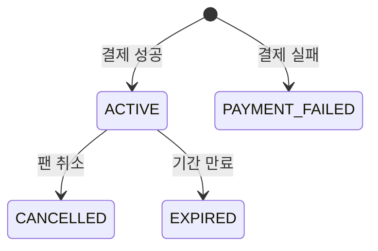
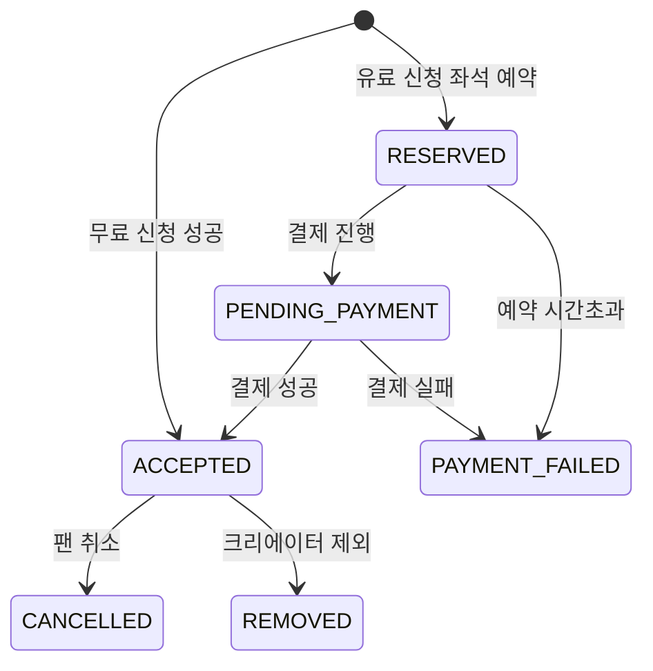
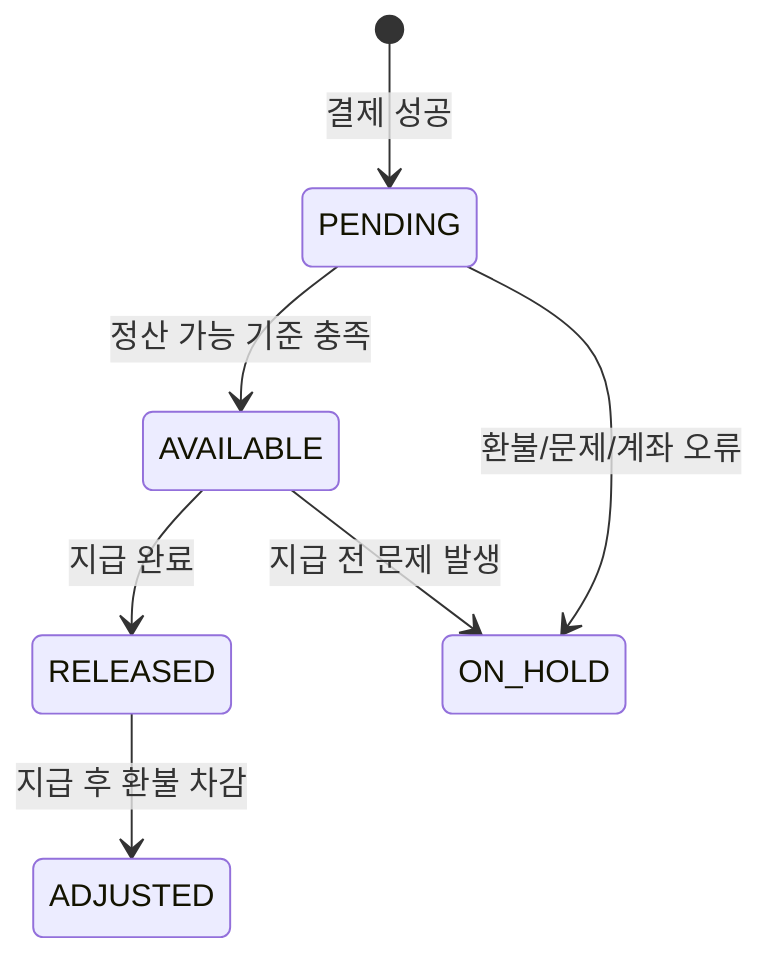

# SPEC-015: 확장 유저플로우 데이터 모델 정합화

> 기준 문서: `ArtBridge_유저플로우_확장안_2026-06-23.md`
> 목적: 수정된 확장 유저플로우를 실제 내부 데이터 모델과 상태 전이에 반영한다. 구현 순서는 멤버십 가입 결제 → 프로그램 선착순 결제 → 크리에이터 정산 → 작품 주문/배송 → 알림 이벤트 확장 순서로 진행한다.

## HISTORY

- 2026-06-23: 최초 작성. 확장 유저플로우 문서의 데이터 모델 영향과 구현 우선순위를 MoAI SPEC으로 변환.

## 1. 개요

ArtBridge의 최신 유저플로우는 심사/협상형 프로그램 신청을 제거하고, 팬이 정원 안에서 바로 신청하거나 결제해 확정되는 구조를 채택한다. 또한 멤버십 가입 결제, 작품 구매/배송, 크리에이터 정산 현황까지 포함하면서 기존 `schema.prisma`의 일부 모델과 상태값이 부족해졌다.

본 SPEC은 화면을 먼저 만들기보다, 후속 구현이 일관된 상태 전이를 사용할 수 있도록 **내부 데이터 모델과 도메인 상태를 먼저 정합화**한다.

## 2. 범위

### 포함

1. **멤버십 가입 결제 상태 보강**
   - `Membership`에 활성/취소/만료/결제실패를 표현할 상태와 기간 필드 추가
   - 기존 `Payment.membershipId` 기반 결제 구조 유지

2. **프로그램 선착순 신청/결제 데이터 보강**
   - `ProgramApplicationStatus`를 심사형이 아닌 선착순/결제형 상태로 확장
   - `Payment`가 `ProgramApplication` 또는 `Program` 결제를 직접 참조할 수 있게 보강
   - 자리 예약 만료와 결제 실패 상태 저장

3. **크리에이터 정산 현황 보강**
   - 정산 예정/가능/완료/보류/환불차감 상태 표현
   - 정산 가능일, 지급일, 보류 사유, 수익원 식별 정보 추가
   - 환불 차감 또는 보류 내역을 기록할 조정 모델 추가

4. **작품 판매/주문/배송 데이터 추가**
   - 작가 작업물 아카이브와 판매 작품 모델 분리
   - 작품 주문, 배송, 재고 예약, 문제 신고 모델 추가
   - 작품 결제가 `Payment`와 정산에 연결되도록 보강

5. **알림 이벤트 타입 정리**
   - 기존 `Notification.type String`을 유지하되, 결제/배송/멤버십/정산 이벤트 타입 상수를 정의

### 제외

- 실제 PG 결제 연동 변경. SPEC-012의 결제 검증 구조를 재사용한다.
- 화면 UI 구현. 본 SPEC은 데이터 모델과 서버 도메인 상태의 계획이다.
- 자동 정기결제, 결제수단 저장, 일할 계산, 부분 환불 자동화.
- 배송사 API 실시간 연동. MVP는 송장번호 수동 입력과 상태 저장으로 시작한다.
- 운영자 어드민 전체 구현. 필요한 모델과 상태만 정의한다.

## 3. 관련 현재 모델

- `MembershipPlan`: 멤버십 플랜 가격과 설명을 보유한다.
- `Membership`: 현재 `userId`, `planId`, `startedAt`만 있어 활성/취소/만료 상태 표현이 부족하다.
- `Program`: `priceKrw`, `maxParticipants`, `status`가 있어 유료/무료 프로그램 구분은 가능하다.
- `ProgramApplication`: 현재 `PENDING`, `ACCEPTED`, `REJECTED`, `AUTO_REJECTED`, `CANCELLED` 중심이라 선착순 결제 상태 표현이 부족하다.
- `Payment`: 현재 `membershipId`, `contractId`, `postId`만 참조한다. 프로그램 신청 결제와 작품 주문 결제 연결 필드가 없다.
- `Settlement`: 현재 `paymentId`, `payout`, `status`만 있어 정산 가능일, 보류 사유, 수익원 구분, 환불 차감 표현이 부족하다.
- `Notification`: `type String` 구조라 enum 변경 없이 이벤트 타입 확장 가능하다.

## 4. 데이터 모델 요구사항

### 4.1 멤버십 상태

- `MembershipStatus` enum을 추가한다.
  - `ACTIVE`
  - `CANCELLED`
  - `EXPIRED`
  - `PAYMENT_FAILED`
- `Membership`에 다음 필드를 추가한다.
  - `status MembershipStatus @default(ACTIVE)`
  - `expiresAt DateTime?`
  - `cancelledAt DateTime?`
  - `lastPaymentId String?`
- `Membership`은 결제 성공 후 `ACTIVE`가 되어야 한다.
- 결제 실패가 멤버십 레코드 생성 전이면 `Membership`을 만들지 않아도 된다.
- 이미 존재하는 멤버십을 갱신하는 경우, `lastPaymentId`와 기간 필드를 업데이트한다.

### 4.2 프로그램 선착순 결제

- `ProgramApplicationStatus`를 다음 의미로 재정의한다.
  - `PENDING`: 레거시 또는 문의/초기 상태. 신규 선착순 플로우에서는 가능한 한 사용하지 않는다.
  - `RESERVED`: 유료 프로그램 결제 전 좌석 예약
  - `PENDING_PAYMENT`: 결제창 진입 또는 결제 처리 중
  - `ACCEPTED`: 무료 신청 즉시 확정 또는 유료 결제 완료 확정
  - `PAYMENT_FAILED`: 결제 실패 또는 시간초과
  - `CANCELLED`: 팬 직접 취소
  - `REMOVED`: 크리에이터가 확정 멤버에서 제외
  - `REJECTED`, `AUTO_REJECTED`: 레거시 호환용으로 유지하되 신규 플로우에서는 사용하지 않는다.
- `ProgramApplication`에 다음 필드를 추가한다.
  - `paymentExpiresAt DateTime?`
  - `paymentFailedAt DateTime?`
  - `cancelledAt DateTime?`
  - `removedAt DateTime?`
  - `removedReason String?`
- `Payment`에 `programApplicationId String? @unique`를 추가한다.
- 유료 프로그램은 한 신청에 결제 1건을 원칙으로 한다.
- 결제 실패 또는 예약 만료 시 정원 계산에서 제외되어야 한다.

### 4.3 정산

- `SettlementStatus`를 확장한다.
  - `PENDING`: 정산 예정
  - `AVAILABLE`: 정산 가능
  - `RELEASED`: 정산 완료
  - `ON_HOLD`: 정산 보류
  - `ADJUSTED`: 환불 또는 차감 반영
- `Settlement`에 다음 필드를 추가한다.
  - `sourceType String?`
  - `sourceId String?`
  - `grossAmount Int`
  - `feeKrw Int @default(0)`
  - `payout Int`
  - `availableAt DateTime?`
  - `releasedAt DateTime?`
  - `heldReason String?`
- `SettlementAdjustment` 모델을 추가한다.
  - `id`
  - `settlementId`
  - `type`
  - `amount`
  - `reason`
  - `createdAt`
- 정산 원천은 최소 `MEMBERSHIP`, `POST`, `PROGRAM`, `ARTWORK`를 표현해야 한다.

### 4.4 작품/주문/배송

- `CreatorWork` 모델을 추가한다.
  - 기존 작업물, 전시, 프로젝트 기간, 이미지, 설명, 외부 링크를 저장한다.
- `Artwork` 모델을 추가한다.
  - 판매 가능한 작품의 제목, 설명, 가격, 재고, 공개 상태, 대표 이미지, 크리에이터를 저장한다.
- `ArtworkInventoryReservation` 모델을 추가한다.
  - 결제 중 한정 작품 중복 구매를 막기 위해 예약자, 만료시각, 상태를 저장한다.
- `ArtworkOrder` 모델을 추가한다.
  - 주문 상태, 배송지, 수령자명, 연락처, 배송 요청사항, 배송비, 결제 연결을 저장한다.
- `ArtworkShipment` 모델을 추가한다.
  - 택배사, 송장번호, 발송일, 배송 완료일을 저장한다.
- `ArtworkOrderIssue` 모델을 추가한다.
  - 미배송, 파손, 오배송, 환불 요청 등 문제 신고와 처리 상태를 저장한다.
- `Payment`에 `artworkOrderId String?`를 추가한다.

### 4.5 알림 이벤트 타입

- `Notification.type`은 문자열 필드로 유지한다.
- 앱 레이어에 알림 타입 상수를 정의한다.
  - `MEMBERSHIP_PAYMENT_PAID`
  - `MEMBERSHIP_PAYMENT_FAILED`
  - `MEMBERSHIP_CANCELLED`
  - `PROGRAM_SEAT_RESERVED`
  - `PROGRAM_PAYMENT_PAID`
  - `PROGRAM_PAYMENT_FAILED`
  - `PROGRAM_APPLICATION_CANCELLED`
  - `PROGRAM_PARTICIPANT_REMOVED`
  - `ARTWORK_ORDER_PAID`
  - `ARTWORK_SHIPPED`
  - `ARTWORK_DELIVERED`
  - `ARTWORK_ORDER_ISSUE_OPENED`
  - `SETTLEMENT_AVAILABLE`
  - `SETTLEMENT_RELEASED`
  - `SETTLEMENT_ON_HOLD`

## 5. 기능 요구사항 (EARS)

### 멤버십

- **REQ-MEM-001**: WHEN 팬의 멤버십 결제가 성공하면, THE SYSTEM SHALL 해당 플랜의 `Membership`을 `ACTIVE`로 생성하거나 갱신해야 한다.
- **REQ-MEM-002**: IF 멤버십 결제가 실패하면, THE SYSTEM SHALL 결제 상태를 `FAILED`로 저장하고 멤버십 접근 권한을 부여하지 않아야 한다.
- **REQ-MEM-003**: WHEN 팬이 멤버십을 취소하면, THE SYSTEM SHALL `Membership.cancelledAt`을 기록하고 정책에 따라 `status`를 `CANCELLED` 또는 기간 종료 예정 상태로 전환해야 한다.

### 프로그램

- **REQ-PROG-001**: WHEN 팬이 유료 프로그램을 신청하고 정원이 남아 있으면, THE SYSTEM SHALL `ProgramApplication`을 `RESERVED` 또는 `PENDING_PAYMENT`로 생성하고 `paymentExpiresAt`을 기록해야 한다.
- **REQ-PROG-002**: WHEN 유료 프로그램 결제가 성공하면, THE SYSTEM SHALL 연결된 `ProgramApplication`을 `ACCEPTED`로 변경해야 한다.
- **REQ-PROG-003**: IF 결제가 실패하거나 제한 시간이 지나면, THE SYSTEM SHALL `ProgramApplication`을 `PAYMENT_FAILED`로 변경하고 정원 계산에서 제외해야 한다.
- **REQ-PROG-004**: WHEN 무료 프로그램 신청 시 정원이 남아 있으면, THE SYSTEM SHALL 별도 결제 없이 `ProgramApplication`을 `ACCEPTED`로 생성해야 한다.
- **REQ-PROG-005**: WHEN 크리에이터가 확정 참여자를 제외하면, THE SYSTEM SHALL 상태를 `REMOVED`로 변경하고 유료 결제 건은 환불 또는 환불 대기 상태로 연결해야 한다.

### 정산

- **REQ-SET-001**: WHEN 결제가 `PAID`가 되면, THE SYSTEM SHALL 결제 원천에 맞는 `Settlement`를 `PENDING`으로 생성해야 한다.
- **REQ-SET-002**: WHEN 멤버십/포스트/프로그램/작품별 정산 가능 기준을 만족하면, THE SYSTEM SHALL `Settlement.status`를 `AVAILABLE`로 변경하고 `availableAt`을 기록해야 한다.
- **REQ-SET-003**: IF 환불, 배송 문제, 계좌 오류, 결제 권한 부여 실패가 발생하면, THE SYSTEM SHALL 정산을 `ON_HOLD`로 변경하거나 `SettlementAdjustment`를 생성해야 한다.
- **REQ-SET-004**: WHEN 운영자가 정산 지급을 완료하면, THE SYSTEM SHALL `Settlement.status`를 `RELEASED`로 변경하고 `releasedAt`을 기록해야 한다.

### 작품 주문/배송

- **REQ-ART-001**: WHEN 크리에이터가 작품을 판매 등록하면, THE SYSTEM SHALL `Artwork`에 가격, 재고, 공개 상태를 저장해야 한다.
- **REQ-ART-002**: WHEN 팬이 한정 작품 체크아웃에 진입하면, THE SYSTEM SHALL `ArtworkInventoryReservation`을 생성해 결제 중 재고 충돌을 막아야 한다.
- **REQ-ART-003**: WHEN 작품 결제가 성공하면, THE SYSTEM SHALL `ArtworkOrder`와 `Payment.artworkOrderId`를 연결하고 재고를 차감해야 한다.
- **REQ-ART-004**: WHEN 크리에이터가 발송 처리하면, THE SYSTEM SHALL `ArtworkShipment`에 택배사, 송장번호, 발송일을 저장해야 한다.
- **REQ-ART-005**: WHEN 팬이 배송 문제를 신고하면, THE SYSTEM SHALL `ArtworkOrderIssue`를 생성하고 주문/정산 상태와 연결해야 한다.

### 알림

- **REQ-NOTI-001**: WHEN 멤버십 결제/프로그램 결제/작품 주문/배송/정산 상태가 변경되면, THE SYSTEM SHALL 정의된 문자열 타입으로 `Notification`을 생성해야 한다.
- **REQ-NOTI-002**: IF 알림 타입이 앱 레이어 상수에 정의되어 있지 않으면, THE SYSTEM SHALL 새 알림을 생성하지 않고 개발 단계에서 테스트가 실패해야 한다.

## 6. 상태 전이

### 멤버십

### 프로그램 신청

### 정산

## 7. 인수 기준

- **AC-001**: `prisma/schema.prisma`에 멤버십 상태, 프로그램 결제 연결, 정산 보강, 작품 주문/배송 모델이 추가되어 Prisma Client 생성이 성공한다.
- **AC-002**: 멤버십 결제 성공 시 `Membership.status = ACTIVE`와 `Payment.membershipId` 연결이 유지된다.
- **AC-003**: 유료 프로그램 결제 성공 시 `Payment.programApplicationId`와 `ProgramApplication.status = ACCEPTED`가 함께 저장된다.
- **AC-004**: 결제 실패 또는 예약 만료된 프로그램 신청은 정원 계산에서 제외된다.
- **AC-005**: 결제 성공 시 수익원별 `Settlement`가 생성되고 `sourceType`이 `MEMBERSHIP`, `POST`, `PROGRAM`, `ARTWORK` 중 하나로 저장된다.
- **AC-006**: 작품 주문 결제 성공 시 `ArtworkOrder`, `Payment.artworkOrderId`, 재고 차감이 한 트랜잭션으로 처리된다.
- **AC-007**: 배송 문제 신고가 접수되면 관련 정산이 `ON_HOLD` 또는 조정 대상으로 식별된다.
- **AC-008**: 정의된 알림 타입 외 문자열을 사용하려는 테스트는 실패한다.
- **AC-009**: 기존 SPEC-003, SPEC-004, SPEC-005, SPEC-006, SPEC-009, SPEC-012의 핵심 테스트가 회귀 없이 통과한다.

## 8. 구현 순서

1. 멤버십 상태 필드 보강
2. 프로그램 신청 결제 연결 필드와 좌석 예약 상태 추가
3. 정산 상태/상세/차감 모델 보강
4. 작품 작업물/작품/주문/배송/문제 신고 모델 추가
5. 알림 타입 상수와 이벤트 생성 규칙 추가
6. 시드 데이터와 테스트 픽스처 갱신
7. Prisma generate, typecheck, lint, test 검증

## 9. 테스트 계획

- Prisma schema validation
- Prisma Client generation
- 멤버십 결제 성공/실패 단위 테스트
- 프로그램 좌석 예약/결제/시간초과 단위 테스트
- 정산 생성/보류/차감 단위 테스트
- 작품 주문/배송/문제 신고 모델 테스트
- 알림 타입 상수 테스트
- 기존 결제/멤버십/프로그램 회귀 테스트

## 10. 리스크와 결정 사항

- `Payment`에 여러 nullable foreign key가 늘어나면 "정확히 하나의 결제 원천만 연결" 제약을 앱 레이어에서 강제해야 한다.
- 기존 계약 기반 프로그램 결제(`contractId`)와 신규 선착순 프로그램 결제(`programApplicationId`)가 공존할 수 있으므로, 레거시 경로를 즉시 삭제하지 않는다.
- 작품 커머스는 기존 MVP 범위를 넘어서는 큰 도메인이므로, 모델 추가 후 화면 구현은 별도 run 단계에서 작게 나누는 것이 좋다.
- 정산 자동 지급은 구현하지 않고, `AVAILABLE`까지 자동 산출한 뒤 `RELEASED`는 운영자/Mock 처리로 시작한다.
