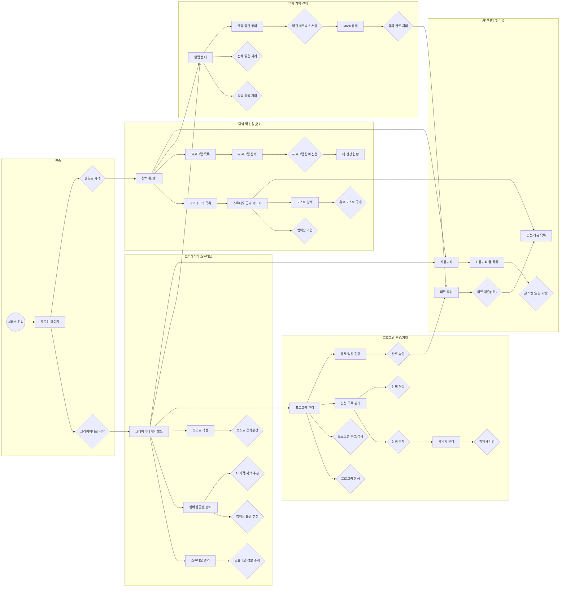

```mermaid
flowchart LR

  subgraph s1 ["인증"]
    n1(("서비스 진입"))
    n2["로그인 페이지"]
    n3{"크리에이터로 시작"}
    n4{"팬으로 시작"}
  end

  subgraph s2 ["크리에이터 스튜디오"]
    n5["크리에이터 대시보드"]
    n6["스튜디오 관리"]
    n7{"스튜디오 정보 수정"}
    n8["멤버십 플랜 관리"]
    n9{"멤버십 플랜 생성"}
    n10{"AI 가격·혜택 추천"}
    n11["포스트 작성"]
    n12{"포스트 공개설정"}
  end

  subgraph s3 ["프로그램 운영/거래"]
    n13["프로그램 관리"]
    n14{"프로그램 생성"}
    n15{"프로그램 수정/삭제"}
    n16["신청 목록 관리"]
    n17{"신청 수락"}
    n18{"신청 거절"}
    n19["계약서 관리"]
    n20{"계약서 서명"}
    n21["결제/정산 현황"]
    n22{"완료 승인"}
  end

  subgraph s4 ["탐색 및 신청(팬)"]
    n23["탐색 홈(팬)"]
    n24["크리에이터 목록"]
    n25["스튜디오 공개 페이지"]
    n26{"멤버십 가입"}
    n27["포스트 상세"]
    n28{"유료 포스트 구매"}
    n29["프로그램 목록"]
    n30["프로그램 상세"]
    n31{"프로그램 참여 신청"}
    n32["내 신청 현황"]
  end

  subgraph s5 ["알림·계약·결제"]
    n33["알림 센터"]
    n34{"알림 읽음 처리"}
    n35{"전체 읽음 처리"}
    n36["계약/약관 동의"]
    n37{"약관 체크박스 서명"}
    n38["Mock 결제"]
    n39{"결제 완료 처리"}
  end

  subgraph s6 ["커뮤니티 및 리뷰"]
    n40["커뮤니티"]
    n41["커뮤니티 글 목록"]
    n42{"글 작성(권한 기반)"}
    n43["리뷰 작성"]
    n44{"리뷰 제출(1회)"}
    n45["평점/리뷰 목록"]
  end

  n1 --> n2
  n2 --> n3
  n2 --> n4
  n3 --> n5
  n4 --> n23
  n5 --> n6
  n6 --> n7
  n5 --> n8
  n8 --> n9
  n8 --> n10
  n5 --> n11
  n11 --> n12
  n5 --> n13
  n13 --> n14
  n13 --> n15
  n13 --> n16
  n16 --> n17
  n16 --> n18
  n17 --> n19
  n19 --> n20
  n13 --> n21
  n21 --> n22
  n23 --> n24
  n24 --> n25
  n25 --> n26
  n25 --> n27
  n27 --> n28
  n23 --> n29
  n29 --> n30
  n30 --> n31
  n31 --> n32
  n5 --> n33
  n23 --> n33
  n33 --> n34
  n33 --> n35
  n33 --> n36
  n36 --> n37
  n37 --> n38
  n38 --> n39
  n5 --> n40
  n23 --> n40
  n40 --> n41
  n41 --> n42
  n39 --> n43
  n22 --> n43
  n43 --> n44
  n44 --> n45
  n25 --> n45
```
