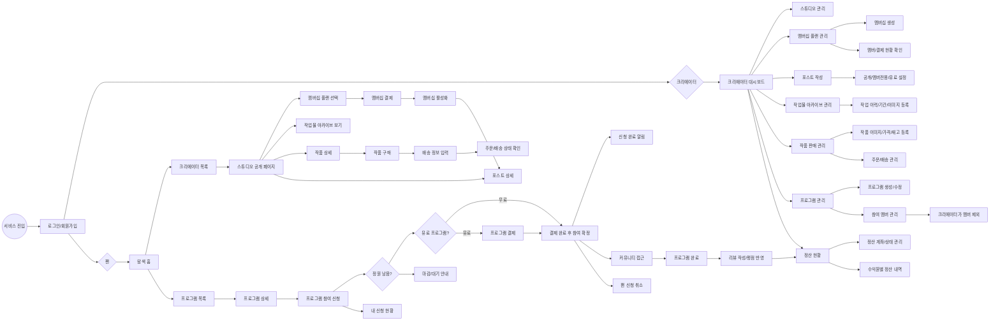

# ArtBridge 유저플로우 확장안

> 작성일: 2026-06-23
> 목적: 기존 MVP 유저플로우를 유지하면서, 신진작가와 팬/크리에이터의 연결을 더 강하게 만드는 추가 화면과 수정 플로우를 정리한다.
> 기준 자료: `ArtBridge 창작자-팬 후원 커뮤니티 MVP_유저플로우_2026-06-21.md.md`, `.moai/project/product.md`, `ArtBridge_화면목록_2026-06-23.md`, 현재 `src/app` 라우트 구조.

---

## 1. 결론 요약

현재 ArtBridge의 핵심 MVP는 다음 축을 이미 갖춘다.

- 팬: 탐색, 스튜디오 방문, 작가 작업물/작품 감상, 작품 구매, 배송 정보 입력, 배송 추적, 수령 확인, 멤버십 가입 결제, 포스트 열람/구매, 프로그램 선착순 신청, 유료 프로그램 결제, 신청 취소/환불, 커뮤니티, 리뷰
- 크리에이터: 스튜디오 관리, 작가 이력/작업물 아카이브 관리, 작품 업로드/판매 관리, 주문/배송 처리, 멤버십/포스트/프로그램 생성, 참여 멤버 확인, 참여 멤버 제외, 멤버십/포스트/프로그램/작품 수익 정산, 커뮤니티
- 공통: 인증, 역할 기반 이동, 알림, 약관/지원/에러 화면

보강이 필요한 핵심은 "기능 추가"보다 "연결 밀도"다. 다만 프로그램 참여는 심사/협상형이 아니라 정원 기반 선착순으로 단순화한다. 무료 프로그램은 팬이 신청하면 정원이 남아 있는 즉시 참여가 확정되고, 유료 프로그램은 정원을 먼저 짧게 예약한 뒤 고정가 결제 완료 시 참여가 확정된다. 정원이 차면 신청이 막힌다.

따라서 추가 플로우는 다음 21개를 우선한다.

| 우선순위 | 추가 플로우 | 목적 | 성격 |
|---|---|---|---|
| P0 | 팬 취향 온보딩/매칭 | 팬이 맞는 작가와 프로그램을 빨리 발견 | 신규 화면 |
| P0 | 크리에이터 시작 체크리스트 | 신진작가가 프로필, 아카이브, 첫 판매 상품을 순서대로 완료 | 신규 화면 또는 대시보드 보강 |
| P0 | 작가 작업물 아카이브 | 작가가 기존 작업 이력과 프로젝트 기간을 보여줌 | 신규 화면/탭 |
| P0 | 작품 업로드/판매 | 팬이 작가의 실제 작품을 보고 구매할 수 있게 함 | 신규 화면/상품 흐름 |
| P0 | 작품 주문/배송 | 구매 이후 배송지, 발송, 송장, 수령까지 연결 | 신규 거래 흐름 |
| P0 | 크리에이터 주문 처리 | 작가가 주문을 확인하고 발송 상태를 관리 | 신규 운영 화면 |
| P0 | 재고 예약/품절 처리 | 단일 작품 중복 구매와 결제 중 재고 충돌 방지 | 거래 상태 보강 |
| P0 | 주문 취소/환불/문제 해결 | 발송 전 취소, 파손/미배송 신고, 환불 처리 기준 마련 | 운영 플로우 |
| P0 | 멤버십 가입 결제 | 팬이 플랜 선택 후 결제 완료 시 멤버십이 즉시 활성화 | 기존 멤버십 플로우 보강 |
| P0 | 선착순 참여 확정 | 무료는 즉시 확정, 유료는 결제 완료 후 확정 | 기존 신청 플로우 수정 |
| P0 | 유료 프로그램 결제 | 프로그램 가격이 0원보다 크면 결제 완료 후 참여 확정 | 기존 신청 플로우 보강 |
| P0 | 프로그램 자리 예약/결제 시간초과 | 결제 중 좌석을 잠시 잡고 실패/시간초과 시 정원 복구 | 거래 상태 보강 |
| P0 | 참여 멤버 관리 | 크리에이터가 확정 멤버를 보고 제외 가능 | 기존 관리 화면 보강 |
| P0 | 팬 신청 취소 | 팬이 신청 후 직접 취소 가능 | 기존 팬 신청 화면 보강 |
| P1 | 신청 전 문의/FAQ | 신청 전 불확실성 해소 | 기존 상세 화면 보강 |
| P1 | 작가 이력 타임라인 | 전시, 프로젝트, 협업 이력을 기간 기반으로 신뢰화 | 스튜디오 보강 |
| P1 | 크리에이터 정산 설정 | 작품 판매 수익을 받을 계좌/정산 정보를 관리 | 운영 화면 |
| P1 | 크리에이터 정산 현황 | 멤버십, 포스트, 프로그램, 작품 수익의 정산 예정/가능/완료/보류를 관리 | 운영 화면 보강 |
| P1 | 알림 매트릭스 | 구매, 배송, 신청, 취소, 리뷰 이벤트를 누락 없이 전달 | 공통 상태 보강 |
| P1 | 북마크 이후 관계 유지 | 관심 작가의 새 활동을 팬에게 재노출 | 기존 알림/팬 홈 보강 |
| P1 | 커뮤니티 구조화 | 커뮤니티가 단순 게시판이 아니라 관계 공간이 되게 함 | 기존 커뮤니티 탭 보강 |

프로그램 참여 기본 플로우에서 제거한다.

- 크리에이터의 신청자 심사
- 신청 수락/거절 대기
- 포트폴리오 필수 검토
- 계약서 생성
- 금액 조율
- 양측 서명

프로그램은 고정 정원, 고정 가격, 고정 조건을 가진 오퍼링으로 본다. 팬이 신청할 때 크리에이터 심사나 금액 조율은 없지만, 유료 프로그램은 결제가 완료되어야 최종 참여 확정이 된다.

---

## 2. 기존 MVP 플로우

기존 플로우는 "작가가 오퍼링을 만들고, 팬이 신청/결제/참여한 뒤 리뷰로 닫는 거래형 커뮤니티"였다. 확장안에서는 프로그램 참여 부분을 선착순 구조로 바꾼다.

### 기존 화면 그룹

| 그룹 | 주요 화면 | 현재 역할 |
|---|---|---|
| 공통 | 랜딩, 로그인, 회원가입, 약관, 개인정보, 고객지원, 에러 | 서비스 진입과 기본 신뢰 확보 |
| 팬 탐색 | 크리에이터 목록, 스튜디오 공개, 작업물 아카이브, 작품 상세, 작품 구매, 배송 정보 입력, 배송 추적, 프로그램 목록, 프로그램 상세, 포스트 상세 | 작가/콘텐츠/작품/프로그램 발견 |
| 팬 마이페이지 | 팬 홈, 내 신청 현황, 관심 작가, 내 멤버십, 내 신청·결제, 프로필 | 참여 상태와 후속 액션 관리 |
| 크리에이터 운영 | 대시보드, 스튜디오 편집, 작가 이력/작업물 관리, 작품 판매 관리, 주문/배송 관리, 멤버십 관리, 포스트 작성, 프로그램 관리, 참여 멤버 관리, 정산 | 공급자 운영 도구 |
| 거래/관계 | 알림, 신청 취소/멤버 제외, 커뮤니티, 리뷰 | 참여 상태와 관계 유지 |

---

## 3. 수정된 확장 플로우

확장 플로우는 기존 MVP 뒤에 단순히 새 기능을 붙이는 방식이 아니라, 기존 플로우의 앞/중간/뒤 연결점을 보강한다.

```mermaid
flowchart LR
  entry(("서비스 진입")) --> signup["회원가입/로그인"]

  signup --> role{"역할 선택"}
  role --> fanOnboarding["팬 취향 온보딩"]
  role --> creatorOnboarding["크리에이터 시작 체크리스트"]

  fanOnboarding --> preference["관심 장르/예산/참여방식 선택"]
  preference --> matchHome["맞춤 탐색 홈"]
  matchHome --> matchReason["추천 이유 표시"]
  matchReason --> creatorStudio["스튜디오 공개 페이지"]
  matchReason --> programDetail["프로그램 상세"]
  matchReason --> artworkDetail["작품 상세"]

  creatorOnboarding --> profileStep["스튜디오 완성"]
  profileStep --> archiveStep["작업 이력/작업물 등록"]
  archiveStep --> artworkStep["판매 작품 업로드"]
  artworkStep --> firstOffer["첫 멤버십/포스트/프로그램 생성"]
  firstOffer --> launchStudio["스튜디오 공개 준비 완료"]
  firstOffer --> creatorSettlement["정산 설정/현황 준비"]

  creatorStudio --> bookmark["관심 작가 저장"]
  creatorStudio --> membershipPlans["멤버십 플랜"]
  creatorStudio --> archiveTab["작업물/이력 탭"]
  creatorStudio --> artworkShop["작품 탭"]
  membershipPlans --> membershipCheckout["멤버십 결제"]
  membershipCheckout --> membershipPayOk{"결제 성공?"}
  membershipPayOk -->|성공| membershipActive["멤버십 활성화"]
  membershipPayOk -->|실패| membershipRetry["결제 재시도/플랜 복귀"]
  membershipActive --> memberOnlyContent["멤버 전용 포스트/커뮤니티 접근"]
  membershipActive --> fanMembershipManage["팬 멤버십 관리"]
  archiveTab --> trustBeforeBuy["작업 기간/작품 맥락 확인"]
  artworkShop --> artworkDetail
  artworkDetail --> buyArtwork["작품 구매"]
  buyArtwork --> shippingAddress["배송 정보 입력"]
  shippingAddress --> paymentComplete["결제 완료/주문 생성"]
  paymentComplete --> creatorOrderList["크리에이터 주문 관리"]
  creatorOrderList --> shipArtwork["발송 처리/송장 입력"]
  shipArtwork --> tracking["팬 배송 추적"]
  tracking --> delivered["수령 확인"]
  delivered --> artworkReview["작품 구매 후기"]
  artworkReview --> purchaseHistory["구매 내역/작가 정산"]
  purchaseHistory --> creatorSettlement
  bookmark --> activityAlerts["새 작품/새 포스트/새 프로그램 알림"]
  activityAlerts --> returnVisit["재방문"]

  programDetail --> preQuestion["신청 전 문의/FAQ"]
  preQuestion --> apply["참여 신청"]
  apply --> capacity{"정원 확인"}
  capacity -->|남음| programFee{"참가비 있음?"}
  capacity -->|마감| closed["마감 안내"]
  programFee -->|무료| confirmed["참여 즉시 확정"]
  programFee -->|유료| seatHold["자리 예약"]
  seatHold --> programCheckout["프로그램 결제"]
  programCheckout --> paymentOk{"결제 성공?"}
  paymentOk -->|성공| confirmed["결제 완료 후 참여 확정"]
  paymentOk -->|실패/시간초과| releaseSeat["자리 예약 해제"]
  releaseSeat --> programDetail
  confirmed --> fanCancel["팬 신청 취소 가능"]
  confirmed --> participantList["크리에이터 참여 멤버 목록"]
  confirmed --> programRevenue["프로그램 결제 수익"]
  participantList --> creatorRemove["크리에이터 멤버 제외 가능"]
  programRevenue --> creatorSettlement
  memberOnlyContent --> membershipRevenue["멤버십 결제 수익"]
  membershipRevenue --> creatorSettlement
  creatorSettlement --> settlementLedger["정산 예정/가능/완료/보류"]
  settlementLedger --> payoutRelease["정산 지급 또는 보류"]
  confirmed --> community["구조화된 커뮤니티"]
  community --> communityTabs["공지/작업과정/피드백/후기"]
  communityTabs --> completion["프로그램 완료"]
  completion --> mutualReview["상호 리뷰"]
  mutualReview --> trustProfile["작가/팬 신뢰 프로필 강화"]
  trustProfile --> matchHome
```

---

## 4. 추가/수정 화면 목록

기존 29개 화면에 아래 화면/섹션을 추가한다.

| # | 화면/섹션 | 권장 라우트 | 신규/수정 | 목적 | 연결 위치 |
|---|---|---|---|---|---|
| 30 | 팬 취향 온보딩 | `/onboarding/fan` 또는 `/signup?role=fan` 이후 | 신규 | 관심 장르, 예산, 참여 방식, 난이도 수집 | 회원가입 직후 |
| 31 | 맞춤 탐색 홈 | `/dashboard/fan` 보강 | 수정 | 추천 작가/프로그램에 "추천 이유" 표시 | 팬 홈 |
| 32 | 추천 이유 모듈 | 카드 내부 컴포넌트 | 신규 요소 | 왜 이 작가/프로그램이 맞는지 설명 | CreatorCard/ProgramCard |
| 33 | 크리에이터 시작 체크리스트 | `/dashboard/creator` 보강 | 수정 | 스튜디오 완성도와 다음 액션 안내 | 크리에이터 첫 화면 |
| 34 | 신청 전 문의/FAQ | `/programs/[id]` 섹션 | 수정 | 팬의 신청 전 불안 해소 | 프로그램 상세 |
| 35 | 선착순 신청/결제 상태 모듈 | `/programs/[id]` 보강 | 수정 | 정원 남음/마감/자리 예약/결제 필요/신청 완료/취소 가능 상태 표시 | 프로그램 상세 |
| 36 | 참여 멤버 관리 | `/dashboard/creator/programs/[id]/participants` 보강 | 수정 | 확정 멤버 목록 확인 및 제외 처리 | 크리에이터 프로그램 관리 |
| 37 | 팬 신청 취소 | `/dashboard/fan/applications` 보강 | 수정 | 팬이 확정 신청을 직접 취소 | 내 신청 현황 |
| 38 | 관심 작가 활동 피드 | `/dashboard/fan/bookmarks` 또는 `/dashboard/fan` 보강 | 수정 | 북마크 이후 새 활동 재노출 | 팬 홈/관심 작가 |
| 39 | 커뮤니티 카테고리 탭 | `/creators/[id]?tab=community` 보강 | 수정 | 공지/자유/작업과정/후기 분리 | 스튜디오 커뮤니티 |
| 40 | 신뢰 프로필 요약 | `/creators/[id]`, `/dashboard/fan/profile` 확장 | 신규/수정 | 리뷰, 참여 이력, 응답률 등 신뢰 신호 축적 | 리뷰 이후 |
| 41 | 작업물 아카이브 탭 | `/creators/[id]?tab=works` | 신규 | 기존 작업물, 기간, 설명, 이미지로 작가의 맥락 제공 | 스튜디오 공개 |
| 42 | 작업물/이력 관리 | `/dashboard/creator/works` | 신규 | 작가가 전시/프로젝트/작업물을 등록·수정 | 크리에이터 대시보드 |
| 43 | 작품 판매 관리 | `/dashboard/creator/artworks` | 신규 | 판매 작품 이미지, 가격, 재고, 공개 상태 관리 | 크리에이터 대시보드 |
| 44 | 작품 상세/구매 | `/artworks/[id]` 또는 `/creators/[id]?tab=shop` | 신규 | 팬이 작품을 감상하고 구매 | 스튜디오/팬 탐색 |
| 45 | 작품 주문/결제 | `/artworks/[id]/checkout` | 신규 | 배송지, 연락처, 결제 금액, 배송비 확인 후 주문 생성 | 작품 상세 |
| 46 | 팬 작품 주문 내역 | `/dashboard/fan/artwork-orders` | 신규 | 주문 상태, 배송 추적, 수령 확인, 문제 신고 | 팬 마이페이지 |
| 47 | 크리에이터 주문/배송 관리 | `/dashboard/creator/artwork-orders` | 신규 | 주문 확인, 발송 준비, 송장 입력, 발송 완료 처리 | 크리에이터 대시보드 |
| 48 | 작품 주문 상세 | `/artwork-orders/[id]` | 신규 | 팬/크리에이터가 같은 주문의 상태와 이력을 확인 | 주문 내역/배송 관리 |
| 49 | 배송 문제 신고 | `/artwork-orders/[id]/issue` 또는 주문 상세 모달 | 신규 | 미배송, 파손, 오배송, 환불 요청 접수 | 주문 상세 |
| 50 | 작품 판매 정책 설정 | `/dashboard/creator/artworks/settings` | 신규 | 출고지, 기본 배송비, 발송 가능일, 환불 기준 설정 | 작품 판매 관리 |
| 51 | 작품 재고/판매 상태 관리 | `/dashboard/creator/artworks/[id]/inventory` | 신규 | 단일 작품 판매 완료, 재고 수량, 예약 중 상태 관리 | 작품 판매 관리 |
| 52 | 주문 취소/환불 요청 | `/artwork-orders/[id]/cancel` 또는 주문 상세 모달 | 신규 | 팬의 발송 전 취소, 운영자/크리에이터 확인 | 주문 상세 |
| 53 | 운영자 문제 처리 큐 | `/admin/artwork-order-issues` 또는 내부 운영 화면 | 신규 | 파손, 미배송, 환불 분쟁의 최종 처리 | 운영자 |
| 54 | 크리에이터 정산 설정 | `/dashboard/creator/payout-settings` | 신규 | 정산 계좌, 예금주, 사업자/개인 구분, 정산 가능 상태 | 크리에이터 대시보드 |
| 55 | 알림 설정/이력 | `/notifications/settings` 또는 `/notifications` 보강 | 수정 | 구매/배송/신청/취소/리뷰 알림을 한곳에서 확인 | 공통 |
| 56 | 프로그램 주문/결제 | `/programs/[id]/checkout` | 신규 | 유료 프로그램 자리 예약 후 고정 참가비 결제 | 프로그램 상세 |
| 57 | 팬 프로그램 결제 내역 | `/dashboard/fan/payments` 또는 `/dashboard/fan/applications` 보강 | 수정 | 프로그램 결제 상태, 실패, 환불, 영수증 확인 | 팬 마이페이지 |
| 58 | 프로그램 결제 실패/시간초과 | `/programs/[id]/checkout` 상태 화면 | 신규 | 결제 실패 또는 시간초과 시 자리 예약 해제와 재시도 안내 | 프로그램 결제 |
| 59 | 프로그램 환불/취소 정책 | `/programs/[id]` 또는 신청 상세 모듈 | 수정 | 신청 취소 시 환불 가능 여부와 환불 금액 안내 | 프로그램 상세/내 신청 현황 |
| 60 | 멤버십 플랜 결제 | `/creators/[id]/memberships/[planId]/checkout` | 신규 | 플랜 혜택, 결제 금액, 약관 동의 후 결제 완료 시 멤버십 활성화 | 스튜디오 멤버십 탭 |
| 61 | 멤버십 결제 실패/재시도 | `/creators/[id]/memberships/[planId]/checkout` 상태 화면 | 신규 | 결제 실패, 중복 가입, 만료된 플랜 상태를 안내하고 재시도 | 멤버십 결제 |
| 62 | 팬 멤버십 관리 | `/dashboard/fan/memberships` 보강 | 수정 | 가입한 멤버십, 결제 내역, 혜택, 취소/만료 상태 확인 | 팬 마이페이지 |
| 63 | 크리에이터 멤버/후원자 관리 | `/dashboard/creator/members` 또는 `/dashboard/creator/memberships/[id]/members` | 신규/수정 | 멤버십 가입자, 가입일, 결제 상태, 접근 권한 확인 | 크리에이터 멤버십 관리 |
| 64 | 크리에이터 정산 현황 | `/dashboard/creator/settlements` 보강 | 수정 | 수익원별 정산 예정/가능/완료/보류 금액과 지급 가능 여부 확인 | 크리에이터 대시보드 |
| 65 | 크리에이터 정산 상세 | `/dashboard/creator/settlements/[id]` | 신규 | 특정 정산 건의 원천 결제, 수수료, 환불 차감, 지급 상태 확인 | 정산 현황 |
| 66 | 정산 보류/차감 내역 | `/dashboard/creator/settlements/holds` 또는 정산 상세 탭 | 신규 | 환불, 문제 신고, 계좌 오류로 보류/차감된 금액 확인 | 정산 현황 |

---

## 5. 화면별 상세 설계

### 5.1 팬 취향 온보딩

- 레이아웃 영역: 진행 단계 헤더 / 선택 카드 그룹 / 하단 CTA
- 입력 항목:
  - 관심 장르: 회화, 일러스트, 공예, 음악, 독립출판, 사진 등
  - 참여 방식: 멤버십 후원, 유료 포스트, 클래스, 챌린지, 1:1 피드백
  - 예산대: 무료, 1만원 이하, 3만원 이하, 5만원 이하, 10만원 이상
  - 선호 깊이: 가볍게 보기, 꾸준히 후원, 직접 참여, 피드백 받기
- 결과:
  - 팬 홈 추천 섹션의 정렬 기준으로 사용
  - 추천 카드에 "관심 장르 일치", "예산 일치", "초보자 참여 가능" 같은 이유 표시
- 상태:
  - 건너뛰기: 일반 탐색 홈으로 이동
  - 빈 선택: 최소 1개 선택 안내
  - 수정: 팬 프로필에서 다시 설정

### 5.2 맞춤 탐색 홈과 추천 이유

- 기존 `/dashboard/fan`을 보강한다.
- 추천 섹션을 단순 "추천 작가/프로그램"에서 다음 구조로 바꾼다.
  - 나와 맞는 신진작가
  - 이번 주 모집 중인 프로그램
  - 내가 저장한 작가의 새 소식
  - 리뷰가 좋은 첫 참여용 프로그램
- 카드에는 추천 이유 1-2개를 작게 붙인다.
  - 예: `관심 장르: 일러스트`, `3만원 이하`, `입문자 가능`, `북마크 작가의 새 프로그램`

### 5.3 크리에이터 시작 체크리스트

- 기존 `/dashboard/creator`의 액션 그리드를 유지하되, 첫 방문/미완성 상태일 때 체크리스트를 먼저 노출한다.
- 체크 항목:
  - 스튜디오 이름/소개/이미지 등록
  - 대표 작업물 3개 등록
  - 전시/프로젝트/협업 이력 1개 등록
  - 판매 가능한 작품 1개 업로드
  - 첫 멤버십 플랜 만들기
  - 첫 공개 포스트 올리기
  - 첫 프로그램 만들기
  - 커뮤니티 공지 작성
  - 공개 페이지 미리보기
- 각 항목은 기존 라우트로 연결한다.
- 목적은 신진작가가 "무엇부터 해야 팬이 신뢰할 수 있는지"를 바로 알게 하는 것이다.

### 5.4 작업물 아카이브와 작가 이력

- 스튜디오 공개 페이지에 `작업물/이력` 탭을 추가한다.
- 이 탭은 판매보다 먼저 "이 작가가 어떤 작업을 해왔는가"를 보여주는 신뢰 면이다.
- 작가가 등록하는 항목:
  - 제목
  - 작업 유형: 개인작업, 전시, 협업, 커미션, 프로젝트, 출판, 공연 등
  - 기간: 시작일, 종료일 또는 진행 중
  - 대표 이미지 여러 장
  - 설명과 작업 의도
  - 외부 링크
  - 관련 판매 작품 연결
- 팬에게 보이는 구조:
  - 대표 작업물 하이라이트
  - 연도/기간순 타임라인
  - 이미지 갤러리
  - 관련 포스트/프로그램/판매 작품으로 이어지는 CTA
- 상태:
  - 빈 상태: "아직 등록된 작업물이 없습니다"와 작가의 소개/포스트로 이동
  - 로딩: 타임라인 스켈레톤
  - 에러: 재시도와 스튜디오 홈 복귀
- 핵심 목적은 작가의 실력과 세계관을 팬이 구매/후원 전에 확인하게 하는 것이다.

### 5.5 작품 업로드/판매 관리

- 크리에이터 대시보드에 `작품 판매 관리`를 추가한다.
- 작가는 프로그램을 만들지 않아도 작품 자체를 판매할 수 있어야 한다.
- 작가 입력 항목:
  - 작품명
  - 작품 이미지
  - 제작 연도 또는 제작 기간
  - 작품 설명
  - 카테고리/태그
  - 가격
  - 재고 또는 단일 작품 여부
  - 배송/수령 안내
  - 판매 상태: 공개, 비공개, 품절
  - 연결 작업물 또는 관련 포스트
- 팬 구매 흐름:
  - 스튜디오 또는 맞춤 홈에서 작품 발견
  - 작품 상세에서 이미지, 설명, 제작 기간, 가격, 재고 확인
  - 구매 CTA 클릭
  - 배송 정보 입력
  - 결제 완료 후 주문 생성
  - 크리에이터가 발송 처리
  - 팬이 배송 상태와 수령 여부 확인
  - 판매 수익은 배송/수령 정책에 맞춰 크리에이터 정산에 반영
- MVP 단계에서는 기존 `Post`의 유료 구매 구조를 참고하되, 실제 작품 판매는 `Artwork` 모델로 분리하는 것이 좋다. 포스트는 콘텐츠 구매이고, 작품은 실물/디지털 상품 구매라 재고, 배송, 품절, 송장, 수령 확인 상태가 필요하기 때문이다.

### 5.6 작품 주문/배송 플로우

- 작품 구매는 `결제 완료`가 아니라 `배송 완료`까지 닫힌 거래 흐름으로 설계한다.
- 팬 주문 흐름:
  - 작품 상세에서 구매 CTA 클릭
  - 주문 진입 시 재고를 짧은 시간 예약
  - 주문/결제 화면에서 배송지, 수령자명, 연락처, 배송 요청사항 입력
  - 상품 금액, 배송비, 총 결제 금액 확인
  - 결제 완료
  - 주문 상태가 `결제 완료`로 생성
  - 팬 주문 내역에서 배송 상태 확인
  - 배송 완료 후 수령 확인 또는 문제 신고
- 크리에이터 배송 처리 흐름:
  - 주문/배송 관리에서 신규 주문 확인
  - 발송 준비 상태로 변경
  - 택배사와 송장번호 입력
  - 발송 완료 처리
  - 팬에게 배송 시작 알림 발송
  - 배송 완료 또는 팬 수령 확인 후 정산 대상으로 전환
- 주문 상태:
  - 결제 대기: 결제 시도 중
  - 결제 완료: 주문 생성, 크리에이터 확인 전
  - 발송 준비: 크리에이터가 주문 확인
  - 발송 완료: 택배사/송장 입력 완료
  - 배송 완료: 배송사 또는 수동 처리 기준 완료
  - 수령 확인: 팬이 정상 수령을 확인
  - 문제 접수: 파손, 오배송, 미배송, 환불 요청
  - 취소/환불: 발송 전 취소 또는 운영자 처리
- 재고/예약 원칙:
  - 단일 작품은 결제 시도 중 `예약 중` 상태로 잠근다.
  - 결제 성공 시 `판매 완료` 또는 재고 차감 상태로 전환한다.
  - 결제 실패/시간 초과 시 예약을 해제한다.
  - 이미 품절된 작품은 상세 진입은 가능하되 구매 CTA를 비활성화한다.
- 배송비 정책:
  - MVP에서는 작품별 고정 배송비를 권장한다.
  - 다음 단계에서는 무료배송, 착불, 묶음배송, 지역별 배송비를 확장한다.
- 상태:
  - 배송지 누락: 필수 입력 안내
  - 품절: 구매 CTA 비활성화
  - 결제 실패: 주문 생성 없이 재시도
  - 결제 성공 후 주문 생성 실패: 결제 취소 또는 운영자 확인 큐로 이동
  - 발송 지연: 팬에게 지연 안내, 크리에이터에게 처리 알림
  - 문제 접수: 주문 상세에서 문의/증빙 이미지 업로드

### 5.7 팬 작품 주문 내역

- 팬 마이페이지에 `작품 주문 내역`을 추가한다.
- 목록 카드 구성:
  - 작품 이미지와 작품명
  - 작가명
  - 결제 금액
  - 주문일
  - 주문 상태
  - 택배사/송장번호
  - CTA: 배송 조회, 수령 확인, 문제 신고, 후기 작성
- 주문 상세 구성:
  - 작품 정보
  - 결제 요약
  - 배송지
  - 배송 상태 타임라인
  - 작가 발송 메모
  - 문제 신고 이력
- 수령 확인 이후:
  - 작품 후기 작성 CTA 표시
  - 작가 신뢰 프로필에 판매/후기 신호 반영

### 5.8 크리에이터 주문/배송 관리

- 크리에이터 대시보드에 `주문/배송 관리`를 추가한다.
- 목록 필터:
  - 신규 주문
  - 발송 준비
  - 발송 완료
  - 문제 접수
  - 완료
- 주문 카드 구성:
  - 작품명과 썸네일
  - 구매자 이름
  - 배송지 요약
  - 결제 금액
  - 주문 상태
  - 발송 처리 CTA
- 발송 처리 입력:
  - 택배사
  - 송장번호
  - 발송 메모
- 운영 원칙:
  - 발송 완료 전에는 팬 취소/환불 요청이 가능하다.
  - 발송 완료 후에는 문제 신고 플로우로 전환한다.
  - 정산은 최소한 `발송 완료` 이후, 권장으로는 `수령 확인` 또는 정책상 자동 확정 이후에 잡는다.
  - 정산 계좌가 없으면 판매 등록은 가능하되 정산 가능 상태가 아니라고 표시한다.

### 5.9 주문 취소/환불/문제 해결

- 작품 커머스에는 운영자 또는 내부 처리 큐가 필요하다.
- 발송 전 취소:
  - 팬이 주문 상세에서 취소 요청
  - 아직 발송 완료 전이면 자동 취소 또는 크리에이터 확인 후 취소
  - 결제 상태는 `REFUNDED` 또는 환불 대기 상태로 전환
  - 재고는 다시 판매 가능 상태로 복구
- 발송 후 문제 신고:
  - 팬이 미배송, 파손, 오배송, 설명과 다름 중 유형 선택
  - 사진 또는 설명 첨부
  - 주문 상태가 `문제 접수`로 변경
  - 크리에이터에게 알림 발송
  - 운영자 처리 큐에서 환불, 재배송, 부분 보상, 기각 중 결정
- 크리에이터 측 대응:
  - 문제 신고 내용 확인
  - 답변 또는 증빙 등록
  - 재배송 가능 여부 표시
- 상태:
  - 신고 접수 완료
  - 크리에이터 답변 대기
  - 운영자 검토 중
  - 환불 처리
  - 재배송 처리
  - 해결 완료

### 5.10 크리에이터 작품 판매 정책/정산 설정

- 작품 판매 전에 크리에이터가 기본 운영 정보를 설정할 수 있어야 한다.
- 판매 정책 입력:
  - 출고지 또는 발송 지역
  - 기본 배송비
  - 예상 발송일
  - 교환/환불 가능 기준
  - 포장/배송 안내 문구
- 정산 설정 입력:
  - 개인/사업자 구분
  - 예금주
  - 은행명
  - 계좌번호
  - 정산 가능 상태
- 상태:
  - 미설정: 작품 등록은 가능하지만 판매 공개 전 경고
  - 검토 중: 정산 정보 검토 중
  - 정상: 판매/정산 가능
  - 보류: 문제 신고 또는 계좌 오류로 정산 보류

### 5.11 알림 매트릭스

- 확장 플로우가 커질수록 알림이 관계 유지의 핵심 연결점이 된다.
- 팬 알림:
  - 관심 작가 새 작품/새 작업물
  - 작품 결제 완료
  - 발송 시작
  - 배송 완료 또는 수령 확인 요청
  - 문제 신고 접수/처리 결과
  - 멤버십 결제 완료/실패
  - 멤버십 만료 임박 또는 취소 완료
  - 프로그램 신청 확정
  - 프로그램 시작 전 리마인드
  - 신청 취소 완료
- 크리에이터 알림:
  - 새 작품 주문
  - 발송 지연 임박
  - 팬 수령 확인
  - 문제 신고 접수
  - 새 멤버십 가입/취소
  - 멤버십 결제 수익 발생
  - 새 프로그램 신청 확정
  - 팬 신청 취소
  - 정산 예정/정산 가능/정산 완료/정산 보류
- 운영자 알림:
  - 결제 성공 후 주문 생성 실패
  - 결제 성공 후 멤버십 활성화 실패
  - 배송 문제 신고
  - 환불/분쟁 처리 필요
  - 반복 지연 크리에이터
  - 정산 보류 대상 또는 지급 실패

### 5.12 신청 전 문의/FAQ

- 프로그램 상세 하단에 신청 전 FAQ를 배치한다.
- MVP에서는 실시간 채팅 대신 다음으로 시작한다.
  - 크리에이터가 프로그램 생성/수정 시 FAQ 3개 등록
  - 팬은 FAQ 확인 후 신청
  - 필요 시 "문의하기"는 고객지원 또는 커뮤니티 안내로 연결
- 추천 질문:
  - 초보자도 참여 가능한가요?
  - 준비물이 있나요?
  - 피드백은 어떤 방식으로 받나요?
  - 신청 취소 기준은 무엇인가요?

### 5.13 선착순 신청/결제 상태 모듈

- 프로그램 상세의 신청 영역을 심사형 폼이 아니라 정원 기반 상태 모듈로 바꾼다.
- 기본 원칙:
  - 팬이 신청하면 현재 확정 참여자 수와 예약 중 인원을 함께 확인한다.
  - 정원이 남아 있고 프로그램 가격이 0원이면 즉시 참여 확정 상태가 된다.
  - 정원이 남아 있고 프로그램 가격이 0원보다 크면 자리를 짧게 예약하고 결제 화면으로 보낸다.
  - 결제가 완료되면 참여 확정 상태가 된다.
  - 결제가 실패하거나 제한 시간이 지나면 자리 예약을 해제한다.
  - 정원이 가득 차면 신청 버튼 대신 마감 안내를 보여준다.
  - 메시지/문의는 신청 전 FAQ 또는 문의 영역에서 다루고, 참여 확정 조건에는 포함하지 않는다.
- 신청/결제 상태:
  - 신청 가능: 남은 자리 수, 참가비, 신청 CTA 표시
  - 무료 신청 완료: 확정 배지, 내 신청 현황 링크, 신청 취소 버튼 표시
  - 결제 필요: 자리 예약 중, 결제 제한 시간, 결제 CTA 표시
  - 결제 처리 중: 중복 클릭 방지, 새로고침 안내
  - 결제 완료: 참여 확정 배지, 커뮤니티 접근 안내
  - 결제 실패: 실패 사유, 자리 예약 해제, 다시 신청 CTA 표시
  - 결제 시간초과: 자리 예약 해제, 남은 자리가 있으면 재신청 가능
  - 정원 마감: 마감 안내, 관심 작가 저장 또는 다른 프로그램 탐색 CTA 표시
  - 취소 완료: 다시 정원이 남으면 재신청 가능
- 가격 표시:
  - 무료 프로그램: `무료` 또는 `참가비 없음`
  - 유료 프로그램: 참가비, 플랫폼 수수료 여부, 총 결제 금액
  - 할인/쿠폰은 MVP에서는 제외하고, 고정가만 사용한다.

### 5.14 유료 프로그램 결제 플로우

- 프로그램 결제는 작품 구매와 다르게 배송지는 필요 없지만, 좌석 예약과 결제 시간 제한이 필요하다.
- 팬 결제 흐름:
  - 프로그램 상세에서 신청 CTA 클릭
  - 정원 확인
  - 유료 프로그램이면 `ProgramApplication`을 결제 대기 또는 자리 예약 상태로 생성
  - 결제 화면에서 프로그램명, 작가명, 일정, 참가비, 환불 기준 확인
  - 결제 진행
  - 결제 성공 시 신청 상태를 참여 확정으로 변경
  - 결제 실패 또는 시간초과 시 신청 상태를 결제 실패/취소로 변경하고 정원 복구
- 결제 화면 구성:
  - 프로그램 요약
  - 일정과 진행 방식
  - 참가비
  - 환불/취소 기준
  - 결제 수단
  - 결제 제한 시간
  - 결제 CTA
- 프로그램 결제 상태:
  - 결제 대기: 자리 예약 중
  - 결제 진행 중: 결제창 또는 PG 처리 중
  - 결제 완료: 참여 확정
  - 결제 실패: 자리 예약 해제
  - 결제 시간초과: 자리 예약 해제
  - 환불 대기: 팬 취소 또는 크리에이터 제외 후 환불 처리 중
  - 환불 완료: 결제 취소/환불 완료
- 알림:
  - 팬: 자리 예약 완료, 결제 완료, 결제 실패, 결제 시간초과, 환불 완료
  - 크리에이터: 새 유료 참여 확정, 팬 취소, 환불 발생
  - 운영자: 결제 성공 후 신청 확정 실패, 환불 실패, 중복 결제 의심

### 5.15 프로그램 취소/환불 정책

- 유료 프로그램의 신청 취소는 정원 복구뿐 아니라 환불 상태까지 함께 처리해야 한다.
- 팬 취소:
  - 프로그램 시작 전까지 취소 가능
  - 환불 가능 기간이면 결제 상태를 환불 대기 또는 환불 완료로 전환
  - 정원은 즉시 복구하거나 환불 처리 완료 후 복구한다. MVP에서는 취소 완료 시 즉시 복구를 권장한다.
- 크리에이터 멤버 제외:
  - 유료 참여자를 제외하면 환불 처리가 필요하다.
  - 제외 사유를 남긴다.
  - 팬에게 제외 및 환불 알림을 보낸다.
- 크리에이터 프로그램 취소:
  - 전체 참여자에게 프로그램 취소 알림 발송
  - 모든 유료 참여 결제를 환불 대기 상태로 전환
  - 환불 완료 후 프로그램 상태를 취소 완료로 전환
- 환불 기준:
  - MVP에서는 시작 전 전액 환불, 시작 후 고객지원 문의로 단순화한다.
  - 다음 단계에서는 시작 D일 전 환불률, 노쇼, 부분 환불 정책을 추가한다.

### 5.16 멤버십 가입 결제 플로우

- 멤버십은 "가입 버튼 클릭"이 아니라 "플랜 선택, 결제, 권한 활성화"까지 닫힌 흐름으로 설계한다.
- 팬 결제 흐름:
  - 스튜디오 멤버십 탭에서 플랜별 혜택과 가격 확인
  - 플랜 선택
  - 멤버십 결제 화면에서 크리에이터명, 플랜명, 결제 금액, 혜택, 취소/환불 기준 확인
  - 결제 진행
  - 결제 성공 시 `Membership`을 활성 상태로 생성하거나 기존 멤버십을 갱신
  - 결제 완료 직후 멤버 전용 포스트, 멤버 전용 커뮤니티, 멤버십 혜택 영역 접근 허용
- 결제 화면 구성:
  - 플랜 요약
  - 월/기간/단건 등 가격 표시 방식
  - 제공 혜택
  - 결제 금액
  - 환불/취소 안내
  - 결제 수단
  - 결제 CTA
- 상태:
  - 가입 가능: 플랜 공개, 결제 CTA 표시
  - 결제 진행 중: 중복 클릭 방지, 결제 처리 안내
  - 결제 완료: 멤버십 활성화, 멤버 전용 콘텐츠 바로가기
  - 결제 실패: 실패 사유, 재시도 CTA, 다른 결제수단 안내
  - 이미 가입됨: 현재 멤버십 관리 화면으로 이동
  - 플랜 비공개/종료: 가입 불가 안내
- MVP 정책:
  - 자동 정기결제까지 넣기보다, 결제 완료 시 멤버십을 활성화하는 단순 구조를 우선한다.
  - 기간형 멤버십을 쓴다면 만료일과 수동 갱신 CTA를 표시한다.
  - 자동 갱신, 결제수단 저장, 등급 변경, 일할 계산은 다음 단계로 둔다.
- 알림:
  - 팬: 멤버십 결제 완료, 결제 실패, 만료 임박, 취소 완료
  - 크리에이터: 새 멤버 가입, 멤버십 결제 발생, 멤버십 취소
  - 운영자: 결제 성공 후 멤버십 활성화 실패, 중복 결제 의심

### 5.17 팬 멤버십 관리

- 팬 마이페이지의 `내 멤버십`은 단순 목록이 아니라 접근 권한과 결제 상태를 함께 보여준다.
- 카드 구성:
  - 크리에이터명
  - 플랜명
  - 가입일
  - 만료일 또는 다음 갱신 기준
  - 결제 금액
  - 상태: 활성 / 결제 실패 / 취소됨 / 만료됨
  - CTA: 스튜디오 이동, 멤버 전용 콘텐츠 보기, 결제 내역 보기, 취소하기
- 취소 흐름:
  - 팬이 취소 CTA 클릭
  - 취소 전 혜택 종료 시점 안내
  - 취소 확인
  - 상태를 취소됨 또는 기간 종료 예정으로 변경
  - 멤버십 접근 권한을 정책에 맞게 종료
- 환불 흐름:
  - MVP에서는 결제 직후 오류성 환불만 고객지원/운영자 처리로 둔다.
  - 다음 단계에서는 결제 후 N일 이내, 사용 혜택 여부, 부분 환불 기준을 추가한다.

### 5.18 크리에이터 정산 플로우

- 정산은 "계좌 설정"과 별개로, 수익원별 금액이 어떤 상태로 이동하는지 보여줘야 한다.
- 수익원:
  - 멤버십 결제
  - 유료 포스트 구매
  - 유료 프로그램 결제
  - 작품 구매
- 정산 기본 흐름:
  - 팬 결제 성공
  - 결제 건이 수익원 타입과 연결됨
  - 플랫폼 수수료와 결제 수수료가 계산됨
  - 환불 가능 기간 또는 거래 완료 기준 전까지 `정산 예정` 상태
  - 조건 충족 시 `정산 가능` 상태로 전환
  - 정산일 또는 운영자 지급 처리 후 `정산 완료` 상태
- 수익원별 정산 가능 기준:
  - 멤버십: 결제 성공 후 환불 가능 기간이 지나면 정산 가능
  - 유료 포스트: 결제 성공 후 콘텐츠 접근이 정상 처리되면 정산 예정으로 반영
  - 유료 프로그램: 프로그램 취소/환불 가능성이 줄어드는 기준일 또는 프로그램 완료 후 정산 가능
  - 작품 구매: 수령 확인 또는 자동 구매 확정 이후 정산 가능
- 정산 보류 조건:
  - 정산 계좌 미설정 또는 검토 실패
  - 결제 환불 대기
  - 작품 배송 문제 신고
  - 프로그램 전체 취소
  - 중복 결제 또는 결제 성공 후 권한 부여 실패
- 환불/차감:
  - 정산 전 환불은 해당 결제 건을 정산 대상에서 제외한다.
  - 정산 완료 후 환불이 발생하면 다음 정산금에서 차감하거나 운영자 처리 큐로 보낸다.
  - 정산 상세에는 원 결제 금액, 수수료, 환불 차감, 최종 지급액을 모두 표시한다.

### 5.19 크리에이터 정산 현황/상세

- `/dashboard/creator/settlements`는 크리에이터의 수익 운영 홈 역할을 한다.
- 정산 현황 구성:
  - 이번 달 총 매출
  - 정산 예정 금액
  - 정산 가능 금액
  - 정산 완료 금액
  - 보류/차감 금액
  - 정산 계좌 상태
- 필터:
  - 기간
  - 수익원: 멤버십 / 포스트 / 프로그램 / 작품
  - 상태: 예정 / 가능 / 완료 / 보류 / 환불 차감
- 정산 상세 구성:
  - 수익원 유형
  - 팬 결제일
  - 결제 금액
  - 수수료
  - 환불 또는 차감
  - 최종 정산 금액
  - 정산 가능일
  - 지급일
  - 보류 사유
- 크리에이터 액션:
  - 정산 계좌 설정으로 이동
  - 보류 사유 확인
  - 고객지원 문의
  - 영수증/정산 명세 다운로드

### 5.20 참여 멤버 관리

- 크리에이터는 프로그램별 확정 참여자 목록을 볼 수 있다.
- 기존 신청 관리 개념은 "심사 대기 목록"이 아니라 "참여 멤버 목록"으로 바꾼다.
- 카드 구성:
  - 참여자 이름
  - 신청 일시
  - 상태: 참여 확정 / 팬 취소 / 크리에이터 제외
  - 문의 메시지 또는 신청 전 문의 이력은 참고 정보로만 표시
  - 크리에이터 액션: 멤버 제외
- 멤버 제외 시:
  - 해당 팬의 참여 상태는 제외 처리된다.
  - 팬에게 알림을 보낸다.
  - 정원 수가 다시 열린다.

### 5.21 팬 신청 취소

- 팬은 `내 신청 현황`에서 확정된 프로그램 신청을 취소할 수 있다.
- 취소 UX:
  - 취소 버튼 클릭
  - 확인 다이얼로그
  - 취소 완료 후 상태가 `취소됨`으로 변경
  - 프로그램 정원이 다시 열린다.
  - 유료 프로그램이면 환불 상태를 함께 표시한다.
- 취소 제한:
  - 프로그램 시작 이후에는 취소 버튼을 숨기거나 고객지원 문의로 전환한다.
  - MVP에서는 시작일 전까지만 취소 가능으로 둔다.

### 5.22 북마크 이후 관계 유지

- 북마크는 저장에서 끝나지 않고 재방문 동선이 되어야 한다.
- 추가 흐름:
  - 팬이 작가 북마크
  - 작가가 새 작업물/작품/포스트/프로그램/멤버십을 발행
  - 팬 홈 또는 알림에 "관심 작가 새 작품/새 소식" 노출
  - 팬이 다시 스튜디오로 진입
- 화면 보강:
  - `/dashboard/fan/bookmarks`: 작가 목록만이 아니라 최근 활동 요약 추가
  - `/dashboard/fan`: 관심 작가 새 소식 섹션 추가
  - `/notifications`: 북마크 기반 알림 타입 추가

### 5.23 커뮤니티 구조화

- 현재 커뮤니티는 글 목록/작성 중심이다.
- 신진작가와 팬의 관계를 만들려면 목적별 탭이 필요하다.
- 권장 탭:
  - 공지: 일정, 운영 안내, 프로그램 업데이트
  - 작업 과정: 작가의 진행 상황 공유
  - 피드백: 팬 질문/작품 피드백 요청
  - 후기: 프로그램 참여 후기와 멤버 경험
- MVP에서는 `CommunityPost`에 `category`를 추가하지 않고도 UI 필터처럼 시작할 수 있다.
- 다음 단계에서는 `CommunityPost.category` 또는 `type` 필드를 도입한다.

### 5.24 신뢰 프로필 요약

- 리뷰가 단순 목록으로 끝나면 연결 자산이 약하다.
- 작가 스튜디오에는 다음 신뢰 신호를 요약한다.
  - 평균 평점
  - 완료 프로그램 수
  - 등록 작업물 수
  - 판매 작품 수와 품절 이력
  - 리뷰 키워드 상위 3개
  - 멤버 수 또는 참여자 수
  - 최근 활동일
- 팬 프로필에는 다음 신뢰 신호를 축적한다.
  - 참여 완료 수
  - 작성 리뷰 수
  - 노쇼/취소 없이 완료한 이력
  - 크리에이터가 남긴 상호 평가

---

## 6. 수정 후 데모 플로우

기존 데모 14단계를 유지하되, 앞단과 중간 연결을 추가한 버전이다.

| 단계 | 기존/신규 | 사용자 | 행동 | 화면 |
|---|---|---|---|---|
| 1 | 기존 | 공통 | 랜딩에서 서비스 가치 확인 | `/` |
| 2 | 신규 | 팬 | 취향 온보딩에서 관심 장르/예산 선택 | `/onboarding/fan` |
| 3 | 신규 | 팬 | 추천 이유가 붙은 작가/프로그램 확인 | `/dashboard/fan` |
| 4 | 기존 | 팬 | 스튜디오와 프로그램 탐색 | `/creators`, `/programs` |
| 5 | 신규 | 팬 | 관심 작가 북마크 | `/creators/[id]` |
| 6 | 기존 | 크리에이터 | 크리에이터 로그인 | `/login` |
| 7 | 신규 | 크리에이터 | 시작 체크리스트 확인 | `/dashboard/creator` |
| 8 | 기존 | 크리에이터 | 스튜디오 수정 | `/dashboard/creator/edit` |
| 9 | 신규 | 크리에이터 | 기존 작업물과 프로젝트 기간 등록 | `/dashboard/creator/works` |
| 10 | 신규 | 크리에이터 | 판매 가능한 작품 업로드 | `/dashboard/creator/artworks` |
| 11 | 기존 | 크리에이터 | 멤버십/포스트/프로그램 생성 | creator dashboard 하위 |
| 12 | 신규 | 팬 | 작가 멤버십 플랜과 혜택 확인 | `/creators/[id]` 멤버십 탭 |
| 13 | 신규 | 팬 | 멤버십 플랜 선택 후 결제 | `/creators/[id]/memberships/[planId]/checkout` |
| 14 | 신규 | 팬 | 결제 완료 후 멤버십 활성화와 멤버 전용 콘텐츠 접근 확인 | `/dashboard/fan/memberships` |
| 15 | 신규 | 크리에이터 | 새 멤버 가입과 멤버십 결제 수익 확인 | `/dashboard/creator/members` |
| 16 | 신규 | 팬 | 작가 작업물 아카이브와 작품 탭 확인 | `/creators/[id]?tab=works` |
| 17 | 신규 | 팬 | 작품 상세에서 가격/재고/배송 안내 확인 | `/artworks/[id]` |
| 18 | 신규 | 팬 | 배송지와 연락처 입력 후 결제 | `/artworks/[id]/checkout` |
| 19 | 신규 | 크리에이터 | 신규 작품 주문 확인 | `/dashboard/creator/artwork-orders` |
| 20 | 신규 | 크리에이터 | 발송 준비 후 택배사/송장번호 입력 | 작품 주문 상세 |
| 21 | 신규 | 팬 | 발송 전이면 주문 취소 요청 가능 | `/artwork-orders/[id]/cancel` |
| 22 | 신규 | 팬 | 배송 추적, 수령 확인, 문제 신고 | `/dashboard/fan/artwork-orders` |
| 23 | 신규 | 운영자 | 파손/미배송/환불 문제 처리 | `/admin/artwork-order-issues` |
| 24 | 신규 | 공통 | 수령 확인 이후 후기와 작품 정산 예정 상태로 연결 | `/artwork-orders/[id]` |
| 25 | 신규 | 팬 | 신청 전 FAQ 확인 | `/programs/[id]` |
| 26 | 수정 | 팬 | 정원이 남아 있으면 선착순 참여 신청 | `/programs/[id]` |
| 27 | 신규 | 팬 | 유료 프로그램이면 자리 예약 후 결제 | `/programs/[id]/checkout` |
| 28 | 신규 | 팬 | 결제 완료 후 참여 확정 확인 | `/dashboard/fan/applications` |
| 29 | 신규 | 팬 | 결제 실패/시간초과 시 자리 해제와 재신청 확인 | 프로그램 결제 상태 |
| 30 | 신규 | 크리에이터 | 결제 완료된 확정 참여 멤버 목록 확인 | `/dashboard/creator/programs/[id]/participants` |
| 31 | 신규 | 크리에이터 | 필요 시 참여 멤버 제외 및 환불 처리 | 참여 멤버 관리 |
| 32 | 신규 | 팬 | 필요 시 신청 취소 및 환불 상태 확인 | 내 신청 현황 |
| 33 | 수정 | 팬/크리에이터 | 구조화된 커뮤니티 참여 | `/creators/[id]?tab=community` |
| 34 | 기존 | 크리에이터 | 프로그램 완료 처리 | 프로그램 상세/정산 |
| 35 | 신규 | 크리에이터 | 멤버십/포스트/프로그램/작품 수익 정산 현황 확인 | `/dashboard/creator/settlements` |
| 36 | 신규 | 크리에이터 | 보류/환불 차감/지급 완료 내역 확인 | `/dashboard/creator/settlements/[id]` |
| 37 | 기존 | 팬 | 완료 후 리뷰 작성 | `/programs/[id]` |
| 38 | 신규 | 공통 | 멤버십/작품 구매/프로그램 결제/리뷰/작업 이력이 신뢰 프로필과 추천에 반영 | 스튜디오/팬 홈 |

---

## 7. 정보 구조 변경안

```mermaid
flowchart TB
  root["ArtBridge"]

  root --> public["공개 탐색"]
  public --> home["/"]
  public --> creators["/creators"]
  public --> programs["/programs"]
  public --> creatorStudio["/creators/[id]"]
  public --> worksTab["/creators/[id]?tab=works"]
  public --> shopTab["/creators/[id]?tab=shop"]
  public --> membershipCheckout["/creators/[id]/memberships/[planId]/checkout"]
  public --> artworkDetail["/artworks/[id]"]
  public --> artworkCheckout["/artworks/[id]/checkout"]
  public --> programDetail["/programs/[id]"]
  public --> programCheckout["/programs/[id]/checkout"]
  public --> postDetail["/posts/[id]"]

  root --> onboarding["온보딩"]
  onboarding --> fanOnboarding["/onboarding/fan"]
  onboarding --> creatorChecklist["/dashboard/creator 시작 체크리스트"]

  root --> fan["팬 영역"]
  fan --> fanHome["/dashboard/fan"]
  fan --> fanPrefs["취향 설정"]
  fan --> fanBookmarks["/dashboard/fan/bookmarks"]
  fan --> fanApplications["/dashboard/fan/applications"]
  fan --> fanArtworkOrders["/dashboard/fan/artwork-orders"]
  fan --> fanPayments["/dashboard/fan/payments"]
  fan --> fanMemberships["/dashboard/fan/memberships"]
  fan --> membershipPaymentDetail["멤버십 결제/취소 상태"]

  root --> creator["크리에이터 영역"]
  creator --> creatorHome["/dashboard/creator"]
  creator --> studioEdit["/dashboard/creator/edit"]
  creator --> worksManage["/dashboard/creator/works"]
  creator --> artworkManage["/dashboard/creator/artworks"]
  creator --> artworkSettings["/dashboard/creator/artworks/settings"]
  creator --> artworkOrders["/dashboard/creator/artwork-orders"]
  creator --> payoutSettings["/dashboard/creator/payout-settings"]
  creator --> membershipManage["/dashboard/creator/memberships"]
  creator --> creatorMembers["/dashboard/creator/members"]
  creator --> postNew["/dashboard/creator/posts/new"]
  creator --> programManage["/dashboard/creator/programs"]
  creator --> participants["/dashboard/creator/programs/[id]/participants"]
  creator --> settlements["/dashboard/creator/settlements"]
  creator --> settlementDetail["/dashboard/creator/settlements/[id]"]
  creator --> settlementHolds["/dashboard/creator/settlements/holds"]

  root --> shared["거래/관계"]
  shared --> notifications["/notifications"]
  shared --> notificationSettings["/notifications/settings"]
  shared --> artworkPurchases["/artwork-orders/[id]"]
  shared --> artworkCancel["/artwork-orders/[id]/cancel"]
  shared --> artworkIssues["/artwork-orders/[id]/issue"]
  shared --> adminIssues["/admin/artwork-order-issues"]
  shared --> community["/creators/[id]?tab=community"]
  shared --> reviews["리뷰/신뢰 프로필"]
```

---

## 8. 데이터 모델 영향

| 보강 항목 | 현재 모델로 가능 | 추가 모델/필드 후보 |
|---|---|---|
| 팬 취향 온보딩 | 일부 가능하지 않음 | `FanPreference` 또는 `User.preferenceJson` |
| 추천 이유 | 일부 가능 | 추천 로직 레이어. 초기에는 계산 결과만 UI 표시 |
| 크리에이터 체크리스트 | 가능 | 신규 모델 없이 `CreatorProfile`, `MembershipPlan`, `Post`, `Program`, `CommunityPost` 존재 여부로 계산 |
| 작업물 아카이브 | 가능하지 않음 | `CreatorWork` 또는 `PortfolioItem`: 제목, 유형, 시작일, 종료일, 이미지, 설명, 외부 링크 |
| 작품 판매 | 일부 가능 | 초기 실험은 유료 `Post` 구매 구조 참고 가능. 정식은 `Artwork`, `ArtworkImage`, `ArtworkPurchase` 권장 |
| 작품 재고/품절 | 가능하지 않음 | `Artwork.stock`, `Artwork.status`, 단일 작품 여부 필드 |
| 재고 예약 | 가능하지 않음 | `ArtworkInventoryReservation`: artworkId, userId, expiresAt, status |
| 작품 주문/배송 | 가능하지 않음 | `ArtworkOrder`: 주문 상태, 배송지, 수령자명, 연락처, 배송 요청사항, 배송비 |
| 발송/송장 관리 | 가능하지 않음 | `ArtworkShipment`: 택배사, 송장번호, 발송일, 배송 완료일 |
| 작품 문제 신고 | 가능하지 않음 | `ArtworkOrderIssue`: 유형, 내용, 이미지, 처리 상태 |
| 주문 취소/환불 | 일부 가능 | `PaymentStatus.REFUNDED` 활용 + `ArtworkOrder.cancelledAt`, `refundReason` |
| 작품 구매 정산 | 일부 가능 | 기존 `Payment`에 `artworkOrderId` 추가 또는 별도 `ArtworkOrder`/`ArtworkPurchase` 도입 |
| 크리에이터 정산 설정 | 가능하지 않음 | `CreatorPayoutProfile`: 은행, 계좌, 예금주, 검토 상태 |
| 크리에이터 정산 현황 | 일부 가능 | 기존 `Payment`, `Settlement` 활용. 수익원별 조회를 위해 `Settlement.sourceType`, `sourceId`, `availableAt`, `releasedAt`, `heldReason` 후보 |
| 정산 보류/차감 | 일부 가능 | `Settlement.status` 확장 또는 `SettlementAdjustment`: 환불 차감, 보류 사유, 운영자 메모 |
| 알림 매트릭스 | 일부 가능 | 기존 `Notification.type` 확장. 주문/배송/문제/정산 이벤트 타입 추가 |
| 멤버십 가입 결제 | 가능 | 기존 `MembershipPlan`, `Membership`, `Payment.membershipId` 활용 |
| 멤버십 활성/취소/만료 | 일부 가능 | `Membership.status`, `startedAt`, `endedAt`, `cancelledAt`, `expiresAt` 후보. MVP는 결제 성공 후 활성 상태만 우선 |
| 멤버십 결제 실패/환불 | 일부 가능 | `PaymentStatus.FAILED`, `PaymentStatus.REFUNDED` 활용 + 멤버십 활성화 실패 처리 큐 후보 |
| 선착순 신청 확정 | 가능 | `Program.maxParticipants`, `ProgramApplication.status`로 처리 |
| 프로그램 가격 | 가능 | 기존 `Program.priceKrw` 사용. 0이면 무료, 0보다 크면 유료 |
| 프로그램 자리 예약 | 일부 가능 | `ProgramApplication.status`에 `RESERVED` 또는 `PENDING_PAYMENT` 추가 권장. MVP에서는 `PENDING`을 결제 대기로 재해석 가능 |
| 프로그램 결제 | 일부 가능 | 기존 `Payment`는 `contractId`, `postId`, `membershipId` 중심. 계약서 제거 플로우에서는 `programApplicationId` 또는 `programId` 직접 연결 필드 추가 권장 |
| 프로그램 결제 실패/시간초과 | 가능하지 않음 | `PaymentStatus.FAILED` 활용 + `ProgramApplication.paymentExpiresAt`, `paymentFailedAt` 후보 |
| 프로그램 환불 | 일부 가능 | `PaymentStatus.REFUNDED` 활용 + `ProgramApplication.cancelledAt`, `refundReason` 후보 |
| 팬 신청 취소 | 가능 | 기존 `CANCELLED` 상태 활용 |
| 크리에이터 멤버 제외 | 일부 가능 | 기존 상태를 확장해 `REMOVED` 추가 또는 `REJECTED`를 운영 제외로 재해석 |
| 참여 멤버 목록 | 가능 | `ProgramApplication.status = ACCEPTED` 목록 조회 |
| 신청 전 FAQ | 가능하지 않음 | `ProgramFaq` 또는 `Program.faqJson` |
| 북마크 새 활동 피드 | 가능 | `Bookmark`, `Post`, `Program`, `Notification` 조합. `Artwork`, `CreatorWork` 발행 알림 타입 추가 |
| 커뮤니티 카테고리 | 가능하지 않음 | `CommunityPost.category` 또는 `type` |
| 신뢰 프로필 | 일부 가능 | `Review`, `Payment`, `ProgramApplication` 집계. 별도 캐시 필드는 선택 |

---

## 9. 구현 우선순위

### Phase 1: 화면 연결만으로 효과가 큰 작업

1. 프로그램 상세 신청 영역을 선착순 신청/결제 상태 모듈로 변경
2. 유료 프로그램 체크아웃과 결제 실패/시간초과 상태 추가
3. 팬 신청 취소 CTA와 환불 상태 표시 추가
4. 크리에이터 참여 멤버 목록과 제외/환불 액션 추가
5. 멤버십 플랜 선택 후 결제 완료 시 멤버십 활성화 연결
6. 팬 멤버십 관리 화면에 결제 상태, 취소, 혜택 접근 표시
7. 크리에이터 멤버/후원자 관리 화면에 가입자와 결제 상태 표시
8. 크리에이터 정산 현황에 수익원별 예정/가능/완료/보류 금액 표시
9. 크리에이터 대시보드 체크리스트에 작업물/작품 등록 단계 추가
10. 스튜디오 공개 페이지에 작업물/작품 탭 추가
11. 작품 상세에서 배송 안내와 구매 진입점 추가
12. 팬 작품 주문 내역과 크리에이터 주문/배송 관리 화면 추가
13. 발송 전 주문 취소와 문제 신고 CTA 추가
14. 구매/배송/멤버십 결제/프로그램 결제/신청/정산 알림 타입 정리
15. 팬 홈 추천 카드에 추천 이유 라벨 추가
16. 관심 작가 화면에 최근 활동 섹션 추가

### Phase 2: 작은 데이터 모델 확장

1. 팬 취향 설정 저장
2. 작업물 아카이브 저장
3. 작품 판매 모델과 이미지/재고 저장
4. 작품 재고 예약 모델 저장
5. 작품 주문/배송/취소/문제 신고 모델 저장
6. 크리에이터 정산 설정 저장
7. 멤버십 활성/취소/만료 상태 저장
8. 정산 가능일, 정산 보류, 환불 차감 저장
9. 프로그램 결제 대기/시간초과/환불 상태 저장
10. 프로그램 FAQ 저장
11. 커뮤니티 카테고리 저장
12. 크리에이터 제외 상태 저장

### Phase 3: 추천/신뢰 고도화

1. 취향 기반 추천 정렬
2. 작업 이력/작품 구매/배송 완료 이력 기반 작가 신뢰 프로필
3. 리뷰 태그 기반 작가 신뢰 프로필
4. 배송 지연/문제 신고율 기반 운영 신뢰 지표
5. 멤버십 유지 기간과 후원 이력 기반 팬-작가 관계 추천
6. 북마크/멤버십/작품 구매/배송/프로그램 결제/참여 이력 기반 재방문 알림
7. 팬 신뢰 프로필과 상호 평가 요약

---

## 10. 최종 권장 플로우 정의

ArtBridge는 "심사와 협상을 거쳐 거래하는 외주형 플랫폼"이 아니라, 아래처럼 "발견하고 바로 참여하는 정원제 창작 커뮤니티"로 포지셔닝하는 것이 좋다.

```mermaid
flowchart LR
  discover["발견: 취향 기반 추천"] --> archive["이해: 작업물/이력 아카이브"]
  archive --> support["후원: 멤버십 플랜 선택/결제"]
  support --> memberAccess["관계: 멤버 전용 콘텐츠/커뮤니티"]
  archive --> shop["소유: 작품 감상/구매"]
  shop --> delivery["배송: 주문/발송/수령 확인"]
  delivery --> trust["확신: 스튜디오/리뷰/FAQ"]
  memberAccess --> trust
  trust --> ask["확인: FAQ/문의"]
  ask --> apply["신청: 자리 예약"]
  apply --> programPay["결제: 유료 프로그램 고정가 결제"]
  programPay --> programConfirmed["확정: 결제 완료 후 참여 확정"]
  programConfirmed --> manage["관리: 팬 취소/크리에이터 제외/환불"]
  manage --> belong["소속: 멤버십/커뮤니티"]
  belong --> settlement["정산: 수익원별 예정/가능/완료/보류"]
  settlement --> prove["증명: 완료/상호 리뷰"]
  prove --> rediscover["재발견: 신뢰 프로필 기반 추천"]
  rediscover --> discover
```

이 흐름이 살아나면 팬은 "마음에 드는 신진작가를 발견하고, 작업 세계를 이해하고, 작품을 구매해 실제로 받아보거나 프로그램에 바로 참여한다"는 감각을 얻는다. 작가는 "프로그램 운영자"에 머물지 않고, 자신의 작업 이력과 판매 가능한 작품, 주문 배송 이력을 계속 축적하는 창작자 스튜디오를 갖게 된다.

---

## 11. 전체 점검 결과

현재 확장 플로우는 팬과 크리에이터의 핵심 연결을 다음 3개 축으로 재정리한다.

1. 발견과 신뢰: 취향 온보딩, 추천 이유, 스튜디오, 작업물 아카이브, 작가 이력
2. 수익화: 작품 판매, 멤버십, 유료 포스트, 유료/무료 선착순 프로그램
3. 운영과 관계 유지: 주문/배송, 프로그램 결제, 신청 취소/환불, 참여 멤버 관리, 커뮤니티, 알림, 리뷰, 정산

### 충분히 잡힌 흐름

- 팬이 작가를 발견하고 스튜디오로 들어오는 흐름
- 팬이 무료 프로그램을 선착순으로 신청하고 취소하는 흐름
- 팬이 유료 프로그램의 자리를 예약하고 결제 완료 후 참여 확정되는 흐름
- 팬이 멤버십 플랜을 선택하고 결제 완료 후 멤버십 권한을 얻는 흐름
- 크리에이터가 프로그램 참여 멤버를 확인하고 제외하는 흐름
- 크리에이터가 멤버십 가입자와 결제 상태를 확인하는 흐름
- 작가가 기존 작업물과 프로젝트 기간을 쌓는 아카이브 흐름
- 팬이 작품을 구매하고 배송 상태를 확인하는 기본 흐름
- 크리에이터가 멤버십/포스트/프로그램/작품 수익을 정산 상태별로 확인하는 흐름
- 작품 구매 이후 후기와 작가 신뢰 프로필로 이어지는 흐름

### 추가가 필요한 핵심 보강

| 보강 지점 | 이유 | 권장 처리 |
|---|---|---|
| 재고 예약 | 단일 작품이나 한정 재고는 결제 중 중복 구매 위험이 있음 | 체크아웃 진입 시 짧은 예약 상태 생성 |
| 발송 전 취소 | 팬이 결제 직후 잘못 주문했을 때 빠져나갈 길이 필요 | 발송 전 자동/반자동 취소 플로우 |
| 발송 후 문제 신고 | 파손, 미배송, 오배송은 실물 작품 판매의 필수 예외 | 주문 상세에서 문제 신고와 증빙 업로드 |
| 운영자 처리 큐 | 환불/분쟁은 팬과 작가만으로 닫기 어려움 | 최소한 내부 처리 화면 또는 상태 필요 |
| 정산 설정 | 작가가 판매해도 계좌/정산 정보가 없으면 운영이 막힘 | 판매 공개 전 정산 설정 경고 |
| 정산 현황 | 수익원이 늘어나면 작가가 무엇이 언제 지급되는지 알기 어려움 | 수익원별 정산 예정/가능/완료/보류 장부 |
| 정산 차감/보류 | 환불, 배송 문제, 계좌 오류는 지급액에 직접 영향 | 정산 상세에서 환불 차감과 보류 사유 표시 |
| 멤버십 결제 활성화 | 멤버십은 결제 완료와 접근 권한 부여가 동시에 닫혀야 함 | 결제 성공 후 `Membership` 활성화와 멤버 전용 접근 연결 |
| 멤버십 취소/만료 | 팬이 가입 후 상태를 관리할 수 있어야 신뢰가 생김 | 내 멤버십에서 취소, 만료, 결제 실패 상태 표시 |
| 알림 매트릭스 | 흐름이 길어질수록 사용자가 다음 행동을 놓침 | 구매/배송/신청/취소/문제/정산 알림 타입 정의 |
| 프로그램 자리 예약 | 유료 프로그램 결제 중 정원이 중복 판매될 수 있음 | 신청 시 예약, 결제 실패/시간초과 시 예약 해제 |
| 프로그램 결제 환불 | 유료 참여자가 취소되거나 제외되면 결제 상태도 바뀌어야 함 | 신청 취소/멤버 제외와 환불 상태 연결 |
| MVP 범위 분리 | 기존 제품 문서에서는 배송지 수집이 MVP 제외였음 | 작품 커머스는 확장 플로우로 분리해 단계적 구현 |

### 최종 권장 구조

- MVP 유지: 스튜디오, 멤버십, 멤버십 가입 결제, 포스트, 프로그램 선착순 신청, 유료 프로그램 결제, 커뮤니티, 리뷰
- 확장 1단계: 작업물 아카이브와 작품 탭을 먼저 추가해 작가 스튜디오의 깊이를 만든다.
- 확장 2단계: 작품 상세, 주문/결제, 배송 내역, 주문 관리까지 붙여 커머스로 닫는다.
- 확장 3단계: 작품 재고 예약, 프로그램 자리 예약, 멤버십 취소/만료, 취소/환불, 문제 신고, 운영자 큐, 정산 설정과 정산 현황으로 거래 안정성을 만든다.

결론적으로 지금 플로우에서 더 추가해야 하는 것은 새 탐색 기능보다 **결제 이후의 권한, 배송, 환불, 정산 상태**다. 작품 판매를 넣는 순간 ArtBridge는 커뮤니티 플랫폼에 커머스 레이어가 얹히고, 유료 프로그램과 멤버십을 유지하는 순간 신청/가입이 아니라 결제와 권한 부여까지 닫혀야 한다. 그래서 구매 성공 화면보다 취소, 품절, 파손, 미배송, 결제 실패, 결제 시간초과, 멤버십 만료, 환불, 정산 보류, 환불 차감 같은 상태를 먼저 설계해야 실제 서비스처럼 단단해진다.
