# ArtBridge ERD (코드 기준 v0.8)

> prisma/schema.prisma 기준. 26개 엔티티(model) / 16개 Enum.

# ArtBridge 데이터베이스 ERD 분석

> 근거 파일: `/Users/youngkwang/projects/artbridge/cadet-project/prisma/schema.prisma`
> Engine: PostgreSQL · ORM: Prisma · 단일 스키마(멀티테넌시 없음). 물리 테이블명은 `@@map`으로 snake_case.
> 전수 집계: **모델 26개 · Enum 16개**

## 1. ERD (Mermaid)

```mermaid
erDiagram
    User ||--o| CreatorProfile : "has"
    User ||--o{ Membership : "subscribes"
    User ||--o{ ProgramApplication : "applies"
    User ||--o{ Notification : "receives"
    User ||--o{ Payment : "pays(PaymentFan)"
    User ||--o{ ArtworkInventoryReservation : "reserves"
    User ||--o{ ArtworkOrder : "orders"
    User ||--o{ ArtworkOrderIssue : "raises"
    User ||--o{ Review : "authored(ReviewReviewer)"
    User ||--o{ Review : "received(ReviewReviewee)"
    User ||--o{ CommunityPost : "writes"
    User ||--o{ Bookmark : "bookmarks"
    User ||--o{ PostLike : "likes"
    User ||--o{ PostComment : "comments"
    User ||--o{ Account : "oauth"
    User ||--o{ Session : "sessions"

    Account }o--|| User : "belongs"
    Session }o--|| User : "belongs"

    CreatorProfile ||--o{ MembershipPlan : "offers"
    CreatorProfile ||--o{ Post : "publishes"
    CreatorProfile ||--o{ Program : "runs"
    CreatorProfile ||--o{ CommunityPost : "hosts"
    CreatorProfile ||--o{ Bookmark : "bookmarkedBy"
    CreatorProfile ||--o{ CreatorWork : "portfolio"
    CreatorProfile ||--o{ Artwork : "sells"
    CreatorProfile ||--o| CreatorPayoutAccount : "payout"

    MembershipPlan ||--o{ Membership : "instantiates"
    Membership ||--o{ Payment : "billed"

    Post ||--o{ Payment : "purchased"
    Post ||--o{ PostLike : "liked"
    Post ||--o{ PostComment : "commented"

    Program ||--o{ ProgramApplication : "receives"
    Program ||--o{ Review : "reviewed"

    ProgramApplication ||--o| Contract : "has"
    ProgramApplication ||--o| Payment : "escrow"

    Contract ||--o{ Payment : "settles"

    Payment ||--o| Settlement : "yields"
    Settlement ||--o{ SettlementAdjustment : "adjusts"

    Artwork ||--o{ ArtworkInventoryReservation : "held"
    Artwork ||--o{ ArtworkOrder : "ordered"

    ArtworkOrder ||--o| Payment : "paid"
    ArtworkOrder ||--o| ArtworkShipment : "shipped"
    ArtworkOrder ||--o{ ArtworkOrderIssue : "issues"

    User {
        string id PK
        string email UK
        string name
        Role role
        string passwordHash "nullable(OAuth)"
        datetime emailVerified
    }
    Account {
        string id PK
        string userId FK
        string provider
        string providerAccountId
    }
    Session {
        string id PK
        string sessionToken UK
        string userId FK
        datetime expires
    }
    CreatorProfile {
        string id PK
        string userId FK,UK
        string studioName
        string category
    }
    MembershipPlan {
        string id PK
        string creatorProfileId FK
        string title
        int priceKrw
    }
    Membership {
        string id PK
        string userId FK
        string planId FK
        MembershipStatus status
        datetime expiresAt
    }
    Post {
        string id PK
        string creatorProfileId FK
        string title
        PostVisibility visibility
        PostStatus status
        int priceKrw "nullable"
    }
    PostLike {
        string id PK
        string postId FK
        string userId FK
    }
    PostComment {
        string id PK
        string postId FK
        string authorId FK
        string body
    }
    Program {
        string id PK
        string creatorProfileId FK
        string title
        ProgramStatus status
        int priceKrw
        datetime recruitDeadline
        datetime deletedAt "soft-delete"
    }
    ProgramApplication {
        string id PK
        string programId FK
        string userId FK
        ProgramApplicationStatus status
        datetime deliveryRequestedAt
        datetime completionApprovedAt
        datetime paymentExpiresAt
    }
    Contract {
        string id PK
        string applicationId FK,UK
        json terms
        int agreedAmount
        datetime fanSignedAt
        datetime creatorSignedAt
    }
    Payment {
        string id PK
        string membershipId FK "nullable"
        string programApplicationId FK,UK "nullable"
        string artworkOrderId FK,UK "nullable"
        string contractId FK,UK "nullable"
        string postId FK "nullable"
        string fanUserId FK
        int amount
        PaymentStatus status
        string merchantUid UK "nullable"
    }
    Settlement {
        string id PK
        string paymentId FK,UK
        int grossAmount
        int payout
        SettlementStatus status
        datetime availableAt
    }
    SettlementAdjustment {
        string id PK
        string settlementId FK
        SettlementAdjustmentType type
        int amount
    }
    CreatorPayoutAccount {
        string id PK
        string creatorProfileId FK,UK
        CreatorPayoutBusinessType businessType
        string bankName
        PayoutVerificationStatus verificationStatus
    }
    CreatorWork {
        string id PK
        string creatorProfileId FK
        string title
        string kind
    }
    Artwork {
        string id PK
        string creatorProfileId FK
        string title
        int priceKrw
        int stock
        ArtworkStatus status
    }
    ArtworkInventoryReservation {
        string id PK
        string artworkId FK
        string userId FK
        ArtworkReservationStatus status
        datetime expiresAt
    }
    ArtworkOrder {
        string id PK
        string artworkId FK
        string fanUserId FK
        ArtworkOrderStatus status
        string recipientName
        string shippingAddress
        int totalAmount
    }
    ArtworkShipment {
        string id PK
        string orderId FK,UK
        string carrier
        string trackingNo
        datetime deliveredAt
    }
    ArtworkOrderIssue {
        string id PK
        string orderId FK
        string userId FK
        ArtworkIssueType type
        ArtworkIssueStatus status
        string message
    }
    Notification {
        string id PK
        string userId FK
        string type
        string message
        datetime readAt
    }
    Review {
        string id PK
        string programId FK
        string userId FK "reviewer"
        string revieweeId FK "nullable"
        int rating
        string_arr tags
    }
    CommunityPost {
        string id PK
        string creatorProfileId FK
        string authorId FK
        string title
        string content
    }
    Bookmark {
        string id PK
        string fanId FK
        string creatorProfileId FK
    }
```



> 카디널리티 도출 근거: `@unique` 단일 FK(예: `CreatorProfile.userId @unique`, `Contract.applicationId @unique`)는 1:1(`||--o|`)로, 일반 FK는 1:N(`||--o{`)로 표기. `Account`/`Session`은 자식 관점에서 `}o--||`로 표시. 모든 관계는 `@relation` 정의에서 확인.

## 2. 핵심 엔티티 요약

| 엔티티 | 핵심 필드 | 역할 |
|--------|----------|------|
| User | id, email(UK), role(Role), passwordHash(nullable) | 팬·크리에이터 공통 계정. OAuth 가입자는 비밀번호 null |
| CreatorProfile | userId(UK), studioName, category | 크리에이터 1:1 프로필. 모든 판매·프로그램·작품의 소유 주체 |
| MembershipPlan | creatorProfileId, priceKrw | 크리에이터별 구독 플랜 정의 |
| Membership | userId, planId, status, expiresAt | 팬의 구독 인스턴스. (userId, planId) 유니크 |
| Post | creatorProfileId, visibility, status, priceKrw(nullable) | 크리에이터 게시물. 공개/멤버전용/유료 구분 |
| Program | creatorProfileId, status, recruitDeadline, deletedAt | 모집·진행되는 프로그램. soft-delete 지원 |
| ProgramApplication | programId, userId, status, deliveryRequestedAt, completionApprovedAt | 프로그램 신청 + 에스크로 진행 단위. 납품요청→완료승인 순서 강제 |
| Contract | applicationId(UK), terms(json), 양측 서명일 | 신청 1:1 계약. 1계약 1결제 |
| Payment | 다중 nullable FK(membership/program/artworkOrder/contract/post), fanUserId, status, merchantUid(UK) | 통합 결제. 정확히 하나의 원천만 채움(앱 레이어 제약) |
| Settlement | paymentId(UK), grossAmount, payout, status, availableAt | 결제 1:1 정산. 크리에이터 지급액 산출 |
| SettlementAdjustment | settlementId, type, amount | 정산 조정(환불차감·보류·해제 등) |
| CreatorPayoutAccount | creatorProfileId(UK), bankName, verificationStatus | 크리에이터 1:1 지급 계좌. 검증 상태 관리 |
| Artwork | creatorProfileId, priceKrw, stock, status | 판매 작품. 재고·상태 관리 |
| ArtworkOrder | artworkId, fanUserId, status, 배송정보, totalAmount | 작품 주문. 배송·결제·이슈의 허브 |
| ArtworkShipment | orderId(UK), carrier, trackingNo | 주문 1:1 배송 정보 |
| ArtworkOrderIssue | orderId, userId, type, status | 주문 관련 이슈(미배송·파손 등) 신고 |
| Review | programId, userId(작성자), revieweeId(피평가자, nullable) | 프로그램 내 상호 양방향 평가 |
| Bookmark | fanId, creatorProfileId | 팬의 관심 작가 북마크. 중복 차단 유니크 |
| Account / Session | userId | Auth.js PrismaAdapter 표준 모델(Google OAuth) |

## 3. Enum 목록 (전수 19개)

| Enum | 값 | 용도 |
|------|-----|------|
| Role | FAN, CREATOR | 사용자 역할 구분 |
| PostVisibility | PUBLIC, MEMBER_ONLY, PAID | 게시물 공개 범위 |
| PostStatus | DRAFT, PUBLISHED | 게시물 발행 상태 |
| ProgramApplicationStatus | PENDING, RESERVED, PENDING_PAYMENT, ACCEPTED, REJECTED, AUTO_REJECTED, PAYMENT_FAILED, CANCELLED, REMOVED | 프로그램 신청 생명주기 |
| ProgramStatus | DRAFT, RECRUITING, CLOSED, CONTRACTING, IN_PROGRESS, COMPLETED, CANCELLED | 프로그램 생명주기(전이 시 알림·자동거절 등 부수효과) |
| PaymentStatus | PENDING, PAID, RELEASED, REFUNDED, FAILED | 결제 상태 |
| SettlementStatus | PENDING, AVAILABLE, RELEASED, ON_HOLD, ADJUSTED | 정산 상태 |
| MembershipStatus | ACTIVE, CANCELLED, EXPIRED, PAYMENT_FAILED | 구독 상태 |
| ArtworkStatus | DRAFT, PUBLISHED, RESERVED, SOLD, HIDDEN | 작품 판매 상태 |
| ArtworkReservationStatus | ACTIVE, EXPIRED, CONVERTED, CANCELLED | 작품 재고 예약 상태 |
| ArtworkOrderStatus | PENDING_PAYMENT, PAID, PREPARING, SHIPPED, DELIVERED, RECEIVED, CANCELLED, REFUNDED, ISSUE_OPENED | 작품 주문 생명주기 |
| ArtworkIssueType | NOT_DELIVERED, DAMAGED, WRONG_ITEM, NOT_AS_DESCRIBED, REFUND_REQUEST, OTHER | 주문 이슈 유형 |
| ArtworkIssueStatus | OPEN, REVIEWING, RESOLVED, REJECTED | 주문 이슈 처리 상태 |
| SettlementAdjustmentType | REFUND_DEDUCTION, HOLD, RELEASE, MANUAL_ADJUSTMENT | 정산 조정 유형 |
| CreatorPayoutBusinessType | PERSONAL, SOLE_PROPRIETOR, CORPORATION | 지급 계좌 사업자 유형 |
| PayoutVerificationStatus | PENDING_VERIFICATION, VERIFIED, NEEDS_REVIEW | 지급 계좌 검증 상태 |

> 주의: `ProgramApplicationStatus`/`ProgramStatus`/`PaymentStatus`/`SettlementStatus`/`ArtworkOrderStatus` 5종은 §4 상태머신에서 별도 다룸. 위 표는 그 5종을 포함한 전체 19종을 빠짐없이 나열한 것(설명 칸에 용도 명시).

## 4. 주요 상태머신 전이 흐름

> 아래는 schema의 enum 값과 모델 필드(타임스탬프·주석)에서 도출 가능한 전이를 정리한 것이다. enum은 값 집합만 정의하므로, 화살표는 schema에 존재하는 값/필드 근거로 한정해 제시한다.

### 4.1 ProgramStatus (프로그램 생명주기)
```
DRAFT → RECRUITING → CLOSED → CONTRACTING → IN_PROGRESS → COMPLETED
  │          │           │          │             │
  └──────────┴───────────┴──────────┴─────────────┴──────→ CANCELLED
```
- 기본값 `RECRUITING`. `@MX:NOTE`상 전이가 알림·자동거절 등 부수효과를 유발.
- `CANCELLED`는 다수 단계에서 진입 가능한 종료 상태. soft-delete는 `deletedAt` 필드로 별도 처리.

### 4.2 ProgramApplicationStatus (프로그램 신청 생명주기)
```
PENDING ─┬─→ RESERVED → PENDING_PAYMENT ─┬─→ ACCEPTED
         │                               ├─→ PAYMENT_FAILED  (paymentFailedAt)
         │                               └─→ AUTO_REJECTED   (paymentExpiresAt 경과)
         ├─→ REJECTED        (크리에이터 거절)
         ├─→ AUTO_REJECTED   (자동 거절)
         ├─→ CANCELLED       (cancelledAt, 신청자 취소)
         └─→ REMOVED         (removedAt/removedReason, 운영 제거)
```
- 기본값 `PENDING`. 관련 타임스탬프: `paymentExpiresAt`, `paymentFailedAt`, `cancelledAt`, `removedAt`.
- `ACCEPTED` 이후 에스크로: `deliveryRequestedAt`(크리에이터 납품요청) → `completionApprovedAt`(팬 완료승인) 순서 강제, 완료승인 시 Payment/Settlement RELEASED (`@MX:NOTE` 근거).

### 4.3 PaymentStatus (결제 상태)
```
PENDING ─┬─→ PAID → RELEASED
         │           │
         │           └─→ REFUNDED
         ├─→ FAILED
         └─→ (PAID → REFUNDED)
```
- 기본값 `PENDING`. `PAID`는 결제 완료, `RELEASED`는 에스크로 해제(정산 가능화), `REFUNDED`는 환불, `FAILED`는 실패.

### 4.4 SettlementStatus (정산 상태)
```
PENDING → AVAILABLE → RELEASED
   │          │
   │          └─→ ON_HOLD ──→ ADJUSTED
   └─────────────→ ON_HOLD
        ADJUSTED ←──→ (SettlementAdjustment 발생)
```
- 기본값 `PENDING`. `availableAt` 도래 시 `AVAILABLE`, 지급 완료 시 `RELEASED`.
- `ON_HOLD`(`heldReason`)는 보류, `ADJUSTED`는 `SettlementAdjustment`(REFUND_DEDUCTION/HOLD/RELEASE/MANUAL_ADJUSTMENT) 반영 상태.

### 4.5 ArtworkOrderStatus (작품 주문 생명주기)
```
PENDING_PAYMENT → PAID → PREPARING → SHIPPED → DELIVERED → RECEIVED
       │            │         │          │
       │            │         │          └─(배송 추적: ArtworkShipment)
       │            └─────────┴──────────┴──→ CANCELLED → REFUNDED
       └──→ CANCELLED
   (모든 단계에서) ──→ ISSUE_OPENED  (ArtworkOrderIssue 발생)
```
- 기본값 `PENDING_PAYMENT`. 관련 타임스탬프: `paidAt`, `cancelledAt`, `receivedAt`, `refundReason`.
- 배송은 `ArtworkShipment`(`shippedAt`/`deliveredAt`), 이슈 제기는 `ArtworkOrderIssue`로 연계되어 `ISSUE_OPENED` 진입.
